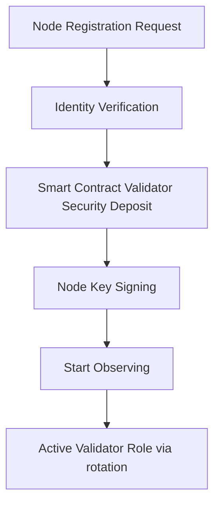

# AST Node Infrastructure Specification

## Purpose

Define the architecture, lifecycle, and technical requirements of the decentralized node infrastructure responsible for processing, validating, and securing transactions within AST.

---

## 1. Node Types

| Node Type          | Role Description                                         |
|--------------------|----------------------------------------------------------|
| **Validator Node** | Actively processes transactions and signs blocks         |
| **Observer Node**  | Standby node that monitors network health & rotates in   |
| **Bootstrap Node** | Handles cold start of the system                         |
| **Governance Node**| Participates in voting & anomaly detection (optional)    |
| **AI Audit Node**  | Verifies contract compliance and audit trails            |

---

## 2. Node Requirements

### a. Base Software

Each node runs:

- AST Node Daemon (`astd`)
- Encrypted Transport Layer (TLS)
- ARO wallet integration module
- Optional: AI plugin interface

### b. Hardware Requirements

| Resource     | Minimum                      |
|--------------|------------------------------|
| CPU          | 4 vCores                     |
| RAM          | 16 GB                        |
| Storage      | 512 GB SSD                   |
| Network      | >100 Mbps, IPv6 supported    |

---

## 3. Node Lifecycle

---

## 4. Registration and Security Deposit

- Validator node must stake minimum X ARO (configurable).
- Smart contract verifies identity and stake.
- Generates node keypair and tokenizes node ID.
- Adds node to candidate pool.

---

## 5. Rotation Logic

- Rotation interval: every 15 minutes
- Rotation criteria:
  - Node uptime
  - Fault rate
  - Governance score
  - Recent activity
- Implemented via NodeRotationContract

---

## 6. Security Model

- TLS for transport
- Token-signed payloads
- Two-key infrastructure: identity key + signing key
- Tamper logging via The All-Seeing Eye module

---

## 7. Misbehavior Handling

| Violation Type | Penalty |
|----------------|---------|
| Downtime > threshold | Temporary suspension |
| Malicious tampering | Stake slashing & blacklist |
| Collusion behavior | AI-auditor flag → governance vote |

---

## 8. Observability Hooks

- All nodes stream logs to Observer Mesh
- Events monitored:
  - Uptime, load, anomalies
  - Protocol version drift
  - Unauthorized packet patterns

---

## 9. Summary

The AST node network is designed to be modular, secure, auditable, and dynamically adjustable via contracts and governance. Observability and automation ensure zero-trust compliance and scalable participation.
