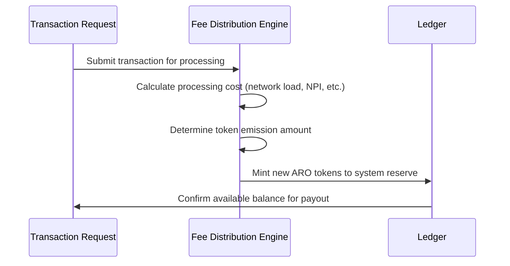

# aro_emission_protocol.md

**## **I. Purpose****

This document defines the **emission protocol** for the native token ARO within the AST (Aros Studio Tokenomics) system. The protocol governs how, when, and under what rules ARO tokens are minted, allocated, and monitored to ensure sustainability, fairness, and transparency.

---

## II. Fee Distribution Principles

1. **No Pre-Transaction Finalization**
    - ARO tokens are **not pre-mined**.
    - Fee Distribution occurs **on-demand**, triggered strictly by transactional activity and systemic utility.
2. **Utility-Based Fee Distribution**
    - ARO tokens are minted as a direct consequence of **transactional processing needs**.
    - Fee Distribution is proportional to the volume and complexity of decentralized processing operations.
3. **Controlled Supply**
    - A **maximum emission cap** is defined in the system config (hard limit).
    - Dynamic emission curves regulate supply inflation over time.

---

## **III. Fee Distribution Trigger Logic**

---

## **IV. Fee Distribution Governance**

| **Component** | **Role** |
| --- | --- |
| Fee Distribution Engine | Calculates when emission is required and how much to emit |
| Node Oracle Committee | Monitors network state to approve emission thresholds |
| All-Seeing Eye | Audits emission actions to prevent abuse or drift from emission law |

---

## **V. Allocation Strategy**

- Emitted tokens are **not immediately released** to the public. Instead, they are:
    1. Stored in a **smart reserve contract**.
    2. Distributed through controlled channels:
        - **Node payments**
        - **Ecosystem bounties**
        - **Infrastructure development fund**

---

## **VI. Fee Distribution Formula (Simplified)**

EMISSION_AMOUNT = Σ(transaction_load × scaling_index × node_payment_ratio)

Where:

- transaction_load: measured in encrypted data segments
- scaling_index: dynamic coefficient based on demand curve
- node_payment_ratio: predetermined % of tokens allocated for node payment

---

## **VII. Fee Distribution Cap and Degradation**

- ARO has a **finite hard cap** (MAX_SUPPLY) enforced at the protocol level.
- Once 80% of MAX_SUPPLY is reached, **emission rate linearly degrades** until halted at 100%.

---

## **VIII. Emergency Brake**

In case of protocol anomaly or exploit:

- The **Fee Distribution Engine** can be halted by multi-signature from:
  - All-Seeing Eye
  - Oracle Committee
  - Founder Authority (if defined in initial config)

---
