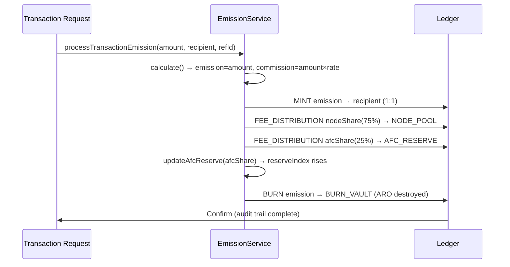

# aro_emission_protocol.md

## I. Purpose

This document defines the **canonical emission protocol** for the native token ARO within the AST (Aros Studio Tokenomics) system. The protocol governs how, when, and under what rules ARO tokens are minted, split as commission, and burned to ensure sustainability, fairness, and transparency.

---

## II. Emission Principles

1. **No Pre-Transaction Finalization**
    - ARO tokens are **not pre-mined**.
    - Emission occurs **on-demand**, triggered strictly by transactional activity.

2. **1:1 Emission**
    - ARO tokens are minted in a **1:1 ratio to the transaction amount**.
    - A transaction of amount `A` emits exactly `A` ARO. No multipliers or complex load indices.

3. **Transient Supply**
    - Emitted ARO are burned after the transaction completes.
    - Net circulating supply change per canonical TX cycle = **0**.
    - The ledger retains full `totalMinted` and `totalBurned` counters for audit.

4. **Controlled Supply via AFC Reserve**
    - There is no hard supply cap; supply is bounded by real transaction volume.
    - The AFC reserve accumulates 25% of every commission, driving the emission price index upward monotonically.

---

## III. Emission Trigger Logic



---

## IV. Canonical Emission Formula

```
Emission       = Transaction Amount           (1:1)
Commission     = Transaction Amount × rate    (default 0.5%)
Node Share     = Commission × 0.75
AFC Reserve    = Commission × 0.25

reserveIndex   = log10(1 + totalProcessVolume)
internalPrice  = base × reserveIndex
```

`totalProcessVolume` is the sum of confirmed PoT-verified process amounts recorded as
`emission.minted` events in NodeChain. AFC accruals are logged separately for audit but
do not enter the reserveIndex formula (spec I-RS-1; `src/reserve/reserve.service.ts`).

---

## V. Emission Governance

| Component              | Role                                                              |
|------------------------|-------------------------------------------------------------------|
| EmissionService        | Implements canonical 1:1 lifecycle; source of truth for emission |
| Node Pool              | Receives 75% of commission per TX and per epoch                  |
| AFC Reserve            | Receives 25% of commission; drives price index upward            |
| All-Seeing Eye         | Audits emission actions to prevent abuse or drift from protocol  |
| Node Oracle Committee  | Monitors network state and approves commission rate changes       |

---

## VI. Allocation Flow

After emission, tokens flow as follows:

1. `SYSTEM_EMISSION_AUTHORITY` mints `emissionAmount` → `recipient`
2. `recipient` pays `nodeShare` (75%) → `SYSTEM_NODE_POOL`
3. `recipient` pays `afcShare` (25%) → `SYSTEM_AFC_RESERVE`
4. `recipient` burns `emissionAmount` → `SYSTEM_BURN_VAULT`

All four steps execute atomically within a single database transaction.

---

## VII. Supply Snapshot Invariants

Per canonical TX cycle:
- `totalMinted` increases by `emissionAmount`
- `totalBurned` increases by `emissionAmount`
- `circulatingSupply` is unchanged (mint and burn cancel out)

---

## VIII. Emergency Brake

In case of protocol anomaly or exploit, the emission engine can be halted by multi-signature from:
- All-Seeing Eye
- Oracle Committee
- Founder Authority (if defined in initial config)

Environment variable `KILL_SWITCH=true` halts all emission transitions; read-only mode persists.

---
