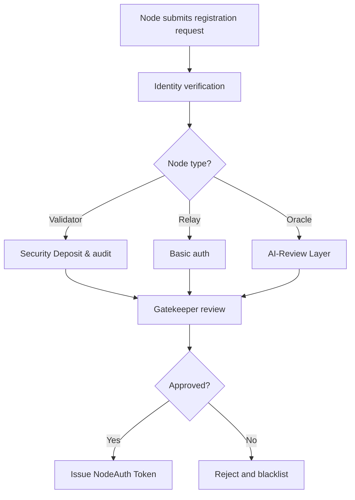

# Node Registration and Authorization

## 🎯 Purpose of This Document

This document defines the lifecycle, rules, and validation logic for registering, authenticating, and maintaining Node participants in the AST NodeChain Engine.

It establishes how nodes are admitted into the decentralized processing layer, under what conditions they can participate, and the mechanisms that ensure trust separation without exposing system vulnerabilities.

---

## 🧩 Core Objectives

1. Outline the **node onboarding process**, including verification, credentialing, and staking (if applicable).
2. Define the **authentication layers** and token standards used for permissioned access.
3. Clarify the role of **gatekeeper logic**, responsible for vetting and monitoring node behavior.
4. Specify conditions for **node exclusion**, suspension, or permanent revocation.
5. Support future integration of **AI-based oracle nodes** with embedded governance constraints.

---

## 🔐 Node Identity & Registration Flow

Nodes are not anonymous by default. Each participant must:

- Register a verifiable cryptographic identity (based on ECDSA or equivalent).
- Submit to multi-stage validation:
  - **Credential verification**: public key, proof-of-origin.
  - **Usage intent declaration**: node type (validator, relay, oracle).
  - **Integrity staking**: optional escrow for trust-sensitive roles.
- Receive a signed authorization token from the Gatekeeper.



---

## **🔑 Authorization Token (NodeAuth)**

All registered nodes receive a NodeAuth token, signed by the Gatekeeper Authority, which:

- Grants scoped access to sharding/encryption routines.
- Defines max load, region, role, and protocol version.
- Has built-in expiry and revocation triggers.

Format (example):

```
{
  "node_id": "0xAE9F...",
  "role": "validator",
  "expires": "2026-12-01T00:00:00Z",
  "signature": "sig<...>",
  "limits": {
    "region": "eu-west-1",
    "tx_per_min": 240,
    "shard_scope": "partial"
  }
}
```

---

## **🚨 Revocation and Suspension**

A node can be suspended or blacklisted for:

- Breach of protocol or performance SLA.
- Suspicious or malformed activity patterns.
- Security audit failure or tampering signals.

Suspensions are temporary and recoverable. Blacklist status is permanent unless manually appealed.

---

## **🧭 Future Layer: Oracle Integration**

Future releases will allow nodes backed by **AI-driven oracle logic** to:

- Be sandboxed in a special processing layer.
- Receive dynamic permissioning via All-Seeing Eye.
- Maintain compliance with cryptoeconomic fairness scoring.

---

## **📁 Repository Location**

```
ast/
└── 02_nodechain_engine/
    └── node_registration_and_auth.md
```
