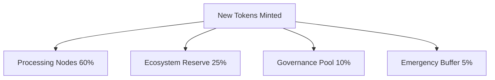

# token_distribution_model.md

## Purpose

This document outlines the distribution logic of newly minted ArosCoins and the token flow between various internal pools and participants of the AST ecosystem. It ensures balanced incentivization, sustainable reserves, and transparent governance over allocation policies.

---

## Distribution Pools

Upon issuance, tokens are distributed into the following pools:

| Pool Name           | Purpose                                             | Default Share |
|---------------------|------------------------------------------------------|---------------|
| **Processing Nodes**| Compensation for participating in transaction processing and encryption | 60% |
| **Ecosystem Reserve** | Long-term project support, partnerships, grants     | 25%           |
| **Governance Pool**  | Used by the All-Seeing Eye for protocol-level proposals and upgrades | 10% |
| **Emergency Buffer** | Crisis fund for economic stabilization and extreme volatility | 5%            |

> These proportions can be rebalanced through governance actions.

---

## Flow of Funds



---

## **Processing Nodes**

- **Direct payouts** occur to addresses that participated in the processing of the originating transaction.
- **Reward split** is proportional to the processing weight (node_weight) of each contributing node.
- Rewards are claimable after passing audit verification to prevent double-claiming.

---

## **Ecosystem Reserve**

- Managed by AST core contributors or All-Seeing Eye governance module.
- Use cases include:
    - Developer grants and bounties
    - Strategic partnerships
    - Marketing and ecosystem expansion
    - Onboarding of validator infrastructure

---

## **Governance Pool**

- Controlled by the All-Seeing Eye governance framework.
- May be used for:
    - Upgrading protocol-level logic
    - Funding audits, legal infrastructure
    - Staking-based community voting incentives

---

## **Emergency Buffer**

- Locked in a multisig vault.
- Released only during:
    - Major system bugs
    - On-chain liquidity crises
    - Severe market attacks or manipulations
- Requires multi-party approval from governance AI and selected human validators.

---

## **Auditability**

All distributions are:

- Fully recorded on-chain.
- Auditable by independent mechanisms.
- Enforced by smart contract checkpoints at the time of minting.

---

## **Linked Documents**

- token_issuance_protocol.md
- node_reward_allocation.md
- aroscoin_supply_model.md

```
🔔 Подтверди, чтобы я создал следующий документ: `aroscoin_supply_model.md`.
```
