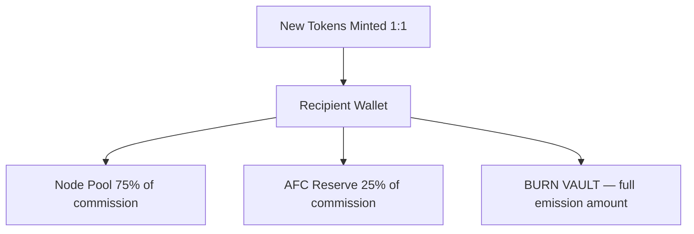

# token_distribution_model.md

## Purpose

This document outlines the distribution logic of newly minted ArosCoins and the token flow between various internal pools and participants of the AST ecosystem. It ensures balanced incentivization, sustainable reserves, and transparent governance over allocation policies.

---

## Distribution Pools

Upon issuance (triggered by the Dynamic Fee Distribution Formula `T_E = α·TV + β·U + γ`), tokens are distributed into the following allocations:

| Pool Name              | Purpose                                                              | Default Share |
|------------------------|----------------------------------------------------------------------|---------------|
| **Node Pool**          | Compensation split by PoT weight among validating nodes              | 75%           |
| **AFC Reserve**        | Accumulated reserve that drives the emission price index upward      | 25%           |

Canonical split per `01_coin_engine/payment_distribution.md` (updated from legacy 60/25/10/5 model). Proportions may be rebalanced through governance actions.

---

## Flow of Funds

---

## **Processing Nodes**

- **Direct payouts** occur to addresses that participated in the processing of the originating transaction.
- **Payment split** is calculated using the Proof-of-Transaction (PoT) formula, weighting the node's contribution to the specific transaction batch.
- Payments are claimable after passing audit verification to prevent double-claiming.

---

## **Ecosystem Reserve**

- Managed by AST core contributors or All-Seeing Eye governance module.
- Use cases include:
  - Developer grants and bounties
  - Strategic partnerships
  - Marketing and ecosystem expansion
  - Onboarding of validator infrastructure

---

## **Governance Pool**

- Controlled by the All-Seeing Eye governance framework.
- May be used for:
  - Upgrading protocol-level logic
  - Funding audits, legal infrastructure
  - Security Deposit-based community voting incentives

---

## **Emergency Buffer**

- Locked in a multisig vault.
- Released only during:
  - Major system bugs
  - On-chain liquidity crises
  - Severe market attacks or manipulations
- Requires multi-party approval from governance AI and selected human validators.

---

## **Auditability**

All distributions are:

- Fully recorded on-chain.
- Auditable by independent mechanisms.
- Enforced by smart contract checkpoints at the time of minting.

---

## **Linked Documents**

- token_issuance_protocol.md
- token_issuance_protocol.md
- node_payment_allocation.md
- aroscoin_supply_model.md

🔔 Подтверди, чтобы я создал следующий документ: `aroscoin_supply_model.md`.
