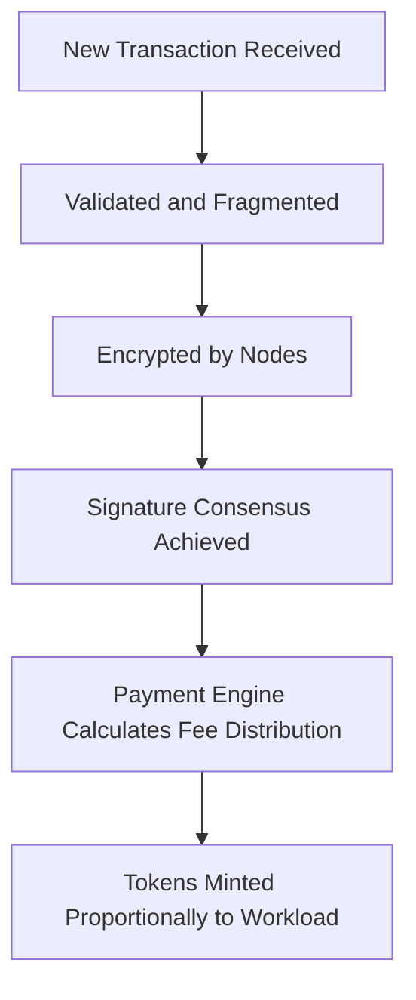

# token_issuance_protocol.md

## Purpose

This document defines the rules, conditions, and algorithmic principles under which new ArosCoins are issued into circulation. The goal is to guarantee fairness, transparency, and utility-driven emission, aligned with AST’s decentralized architecture and transactional economy.

---

## Fee Distribution Principles

- **No Central Authority**: Tokens are not minted by a centralized party. Fee Distribution is triggered solely by on-chain activity.
- **Utility-Driven Supply**: The creation of tokens is directly tied to validated transaction processing. If the system is idle, no new tokens are minted.
- **Finite Maximum Supply**: The total number of ArosCoins is capped. No further issuance is possible once the hard cap is reached.
- **On-Demand Generation**: Tokens are created only when a transaction requires validation and decentralized encryption.

---

## Fee Distribution Trigger Conditions

Tokens are minted **only** when the following criteria are simultaneously met:

1. A transaction has been submitted to the AST processing queue.
2. The transaction has passed validation, fragmentation, and encryption phases.
3. The set of participating nodes successfully completed signature consensus.
4. The node payment calculation engine has produced an eligible emission request.

---

## Fee Distribution Calculation Logic



### **Canonical Formula:**

```
Emission   = Transaction Amount      (1:1)
Commission = Transaction Amount × rate  (default 0.5%)
Node Share = Commission × 0.75       (75% → node pool, split by PoT weight)
AFC Share  = Commission × 0.25       (25% → AFC reserve)
Burn       = Emission Amount         (ARO burned after TX completes)
```

---

## **Token Distribution at Issuance**

Commission from each canonical transaction is distributed as follows:

| **Receiver**    | **Percentage** | **Address**                                  |
| --------------- | -------------- | -------------------------------------------- |
| Node Pool       | **75%**        | `SYSTEM_NODE_POOL_00000000000000000000`      |
| AFC Reserve     | **25%**        | `SYSTEM_AFC_RESERVE_000000000000000000`      |

> Ecosystem grants, governance bounties, and emergency buffers are funded separately from the AFC reserve via governance proposals — they are not slices of the per-TX commission.
> Note: These ratios are tunable via governance within protocol-defined bounds.
> 

---

## **Safeguards**

- **Double-Mint Protection**: Once an emission is triggered, the transaction ID is locked from further issuance.
- **Fork Safety**: All minting events are checkpointed and auditable on-chain.
- **Deposit Forfeiture Risk**: Malicious nodes attempting to inflate minting are penalized via stake slashing.

---

## **Linked Documents**

- token_distribution_model.md
- node_payment_allocation.md
- aroscoin_supply_model.md

---
