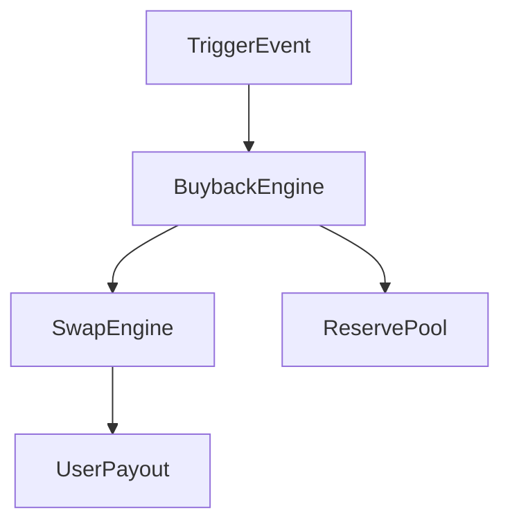

# aroscoin_buyback_mechanism.md

## 1. Purpose

The Buyback Mechanism is designed to regulate ArosCoin’s active circulation by **programmatically repurchasing tokens** from users or reward channels. Its main purpose is to:

- Absorb excess liquidity
- Stabilize systemic velocity
- Refill the Reserve Pool
- Support non-speculative price integrity
- Prevent inflation loops

It is **not a trading engine**, but a value reclamation protocol integrated into the core flow logic.

---

## 2. Trigger Conditions

Buybacks are automatically initiated under one or more of the following conditions:

| Trigger Event               | Description                                                               |
|-----------------------------|---------------------------------------------------------------------------|
| 🧮 Circulation Overload      | Token velocity or transaction volume exceeds predefined ceiling           |
| 📉 Price Pressure            | External price signals or internal economic simulations detect instability |
| 🧾 Reward Overflow           | Validators or users accumulate beyond fair distribution range             |
| 🕳️ Liquidity Gap             | Exit requests cannot be fulfilled due to temporary liquidity shortage      |
| 🛡️ Reserve Depletion Buffer | Reserve Pool signals need for proactive refill                            |

---

## 3. Buyback Execution Pipeline



- **TriggerEvent**: Detected by governance layer, Processing Layer, or All-Seeing Eye.
- **BuybackEngine**: Determines amount, price, source of liquidity.
- **SwapEngine**: Converts system liquidity into user-facing value (fiat or crypto).
- **UserPayout**: Tokens are withdrawn from user and payout is issued.
- **ReservePool**: Collected tokens are routed into non-circulating reserves.

---

## **4. Smart Contract Logic**

```solidity
interface IBuybackEngine {
    function triggerBuyback(uint256 amount, string memory reason) external returns (bool);
    function getBuybackPrice() external view returns (uint256);
    function processUserOptIn(address user, uint256 amount) external returns (bool);
}
```

Users can opt in to buybacks if:

- The system has active buyback mode
- Their wallet is verified and KYC-compliant
- Their token balance qualifies for partial or full return

---

## **5. Buyback Price Logic**

Buyback prices are **not market-based**, but calculated by:

- Systemic velocity analysis
- Price floor commitments
- Treasury reserve status
- Liquidity pressure index
- Governance policy ratios

A formula like the following is used (illustrative only):

$$
BuybackPrice = Max(FloorPrice, TargetRange - VolatilityIndex * RiskBuffer)
$$

Where:

- FloorPrice is protocol-guaranteed
- VolatilityIndex is based on recent internal activity
- RiskBuffer is adjusted by governance or AI

---

## **6. Behavioral Safeguards**

To avoid abuse:

- Buyback volume per epoch is capped
- Participation cooldown exists per address
- Token re-entry into circulation is disabled after buyback
- All events are logged and auditable

---

## **7. Integration Points**

| **Component** | **Role in Buyback System** |
| --- | --- |
| Vault System | May trigger buybacks on expiry of locked assets |
| Internal Flow Engine | Routes reclaimed tokens directly into Reserve |
| Swap Engine | Handles conversion into fiat/crypto for payout |
| Reserve Pool | Final destination for tokens after repurchase |
| Governance Layer | Can approve emergency or large-volume buybacks |
| All-Seeing Eye | Validates macroeconomic legitimacy of buyback trigger |

---

## **8. Anti-Speculation Stance**

The buyback mechanism is designed to **remove value silently**, not reward speculative behavior. It does not promise:

- Premiums above protocol floor
- Unbounded liquidity
- Trading opportunities

It is a tool of **supply discipline**, not a financial incentive scheme.

---

## **9. Next Steps**

Once buyback is defined, we move to defining token velocity governance:

- aroscoin_velocity_control.md
