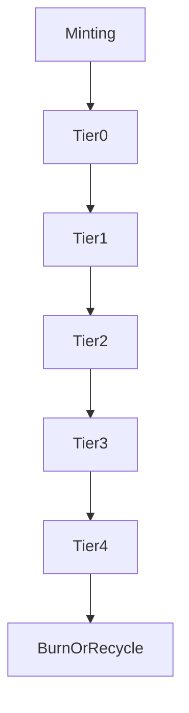

# aroscoin_distribution_tiers.md

### **📑 Содержание документа:**

```markdown
# ArosCoin Distribution Tiers

## 1. Purpose

This document defines the tiered structure through which ArosCoin is distributed across system actors, roles, and activities. Distribution tiers are designed to enforce **predictability, fairness, and anti-inflationary behavior**, while aligning with long-term utility and governance objectives.

---

## 2. Tier Classification

ArosCoin distribution is categorized across five primary tiers:

| Tier               | Description                                                                 |
|--------------------|-----------------------------------------------------------------------------|
| 🧱 Tier 0: Base Layer     | Essential protocol operations (validators, core infrastructure)          |
| 🎓 Tier 1: Growth Layer   | Ecosystem expansion: contributors, developers, integrators              |
| 🗳️ Tier 2: Governance     | Proposal rewards, vote incentives, staking-based power realignment      |
| 🌍 Tier 3: External Use   | Bridged liquidity, partner programs, value corridor strategies           |
| 🔒 Tier 4: Strategic Vault| Long-term reserve releases, treasury-controlled, manual governance lock |

Each tier has specific access rules, velocity caps, and validation triggers.

---

## 3. Distribution Flow Overview
```



This layered flow ensures value moves **gradually outward**, from core operations to strategic externalization or absorption.

---

## **4. Tier Allocation Policies**

| **Tier** | **Max Allocation %** | **Lock Conditions** | **Flow Permissions** |
| --- | --- | --- | --- |
| Tier 0 | 25% | Immediate, rate-capped | Node uptime + verified validator status |
| Tier 1 | 20% | Time-locked for 90–180 days | Developer registration + contribution |
| Tier 2 | 15% | Unlockable after governance action | Verified participation only |
| Tier 3 | 25% | Released by liquidity bridges | Whitelisted entities |
| Tier 4 | 15% | Governance release only | Reserve controller + AI override |

Allocations are recalculated per epoch using dynamic participation metrics.

---

## **5. Tier Contracts & Enforcement**

Each tier has a dedicated smart contract implementing the ITierDistributor interface:

```solidity
interface ITierDistributor {
    function requestDistribution(address user, uint256 amount) external returns (bool);
    function isEligible(address user) external view returns (bool);
    function getTierState() external view returns (TierState memory);
}
```

Tiers are isolated — no contract can migrate tokens between tiers without central protocol approval.

---

## **6. Governance Role**

The Governance Layer can:

- Rebalance allocation ratios across tiers (with supermajority)
- Freeze or delay distributions if systemic risk is flagged
- Propose emergency redistribution during stress events

However, Tier 4 always requires both **quorum + AI validation** to unlock.

---

## **7. Integration Points**

| **Component** | **Role in Tier Logic** |
| --- | --- |
| NodeChain Engine | Triggers Tier 0 flows based on performance |
| Developer Registry | Controls Tier 1 access eligibility |
| Governance Layer | Allocates Tier 2 coins upon vote resolution |
| Tokenization Bridge | Unlocks Tier 3 liquidity with compliance controls |
| Reserve Controller | Controls Tier 4 deployment and emergency protocols |

---

## **8. Tier Design Philosophy**

> “Not all tokens are equal — their role is defined by where and why they are released.”
> 

---

## **9. Next Steps**

Once tiers are in place, the final part of circulation logic defines **when and how** tokens are released in time:

- aroscoin_release_schedule.md