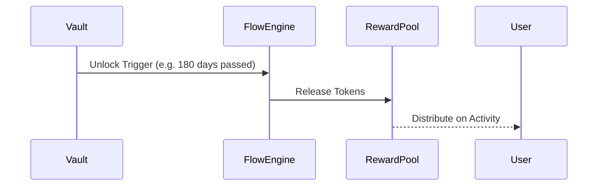

# aroscoin_internal_flow.md

## 1. Purpose

This document defines the deterministic internal movement of ArosCoin between core services, contract layers, and system actors. Unlike public tokens that circulate freely across external wallets and exchanges, ArosCoin moves **only within system-defined channels**, governed by smart contract constraints, validator logic, and flow permissions.

---

## 2. Core Movement Paths

ArosCoin moves across the following internal domains:

| Origin              | Destination              | Conditions                                                      |
|---------------------|---------------------------|------------------------------------------------------------------|
| Vaults              | Reward Pools              | After unlocking trigger or governance vote                      |
| Reward Pools        | Validators / Users        | Based on node uptime, action triggers, or tier release schedule |
| Internal Engine     | Governance Pool           | On proposal participation or quorum logic                       |
| Users               | Buyback Engine            | Voluntary return or price-level triggers                        |
| Buyback Engine      | Reserve Pool / Burn       | Automated based on circulation threshold                        |

Each of these flows is mediated by the **Internal Flow Engine**, which logs every event and enforces throttling limits where necessary.

---

## 3. Flow Control Contracts

All flows are executed through a set of controller contracts that enforce routing permissions and flow caps.

```solidity
interface IInternalFlowRouter {
    function move(address from, address to, uint256 amount, string memory reason) external returns (bool);
    function authorize(address module) external;
    function setThrottleLimit(address module, uint256 maxPerBlock) external;
}
```

These contracts **do not allow arbitrary transfers** and cannot be called directly by users. They are called by whitelisted modules (Vaults, Reward Engine, Governance Pool, Buyback).

---

## **4. Event-Driven Flow Model**

ArosCoin movement is not continuous or passive. It is event-triggered:



Every movement must have:

- A source with authorized release rights
- A destination with valid intake permission
- A protocol-recognized reason for movement

---

## **5. Flow Throttling & Saturation Watch**

To prevent abuse or over-distribution, each module has a maxPerBlock limit. Additionally, the Processing Layer monitors **saturation metrics**:

- flowRatePerBlock
- rewardBacklog
- vaultReleaseQueue
- circulationDensity

Exceeding thresholds may cause delays, rollbacks, or full rejection of movement events.

---

## **6. Systemic Isolation**

To prevent leakage or speculative misuses:

- Tokens cannot leave the Internal Flow Engine unless going to Reserve, Burn, or AI-governed bridge modules
- No peer-to-peer transfer is allowed between wallets
- Users can receive or return tokens, but not re-transfer them independently

---

## **7. Integration Links**

| **Subsystem** | **Role in Flow** |
| --- | --- |
| Vault System | Source of staged tokens |
| Reward Engine | Distribution mechanism based on activity |
| Governance Layer | Logic for locking/unlocking governance coins |
| Buyback Engine | Final absorption of excess circulation |
| Reserve Pool | Long-term value retention |
| Processing Layer | Monitoring and dynamic rollback of flow anomalies |

---

## **8. Internal Flow Is Not “Transfer”**

This model intentionally **breaks the ERC-20-style “transfer” expectation**. Instead of user-triggered transfers, AST enforces:

- **System-triggered flows**
- **Fully audited moves**
- **Only whitelisted paths**
- **Strict throttle governance**

---

## **9. Next Steps**

This logic will be complemented by edge-case boundaries and external interfaces in:

- aroscoin_entry_exit_rules.md
- liquidity_pool_mechanism.md

```
---

Если всё верно — сразу перехожу к следующему файлу:
👉 **`aroscoin_entry_exit_rules.md`** — правила входа/выхода токена из внутренней системы. Подтверди.
```
