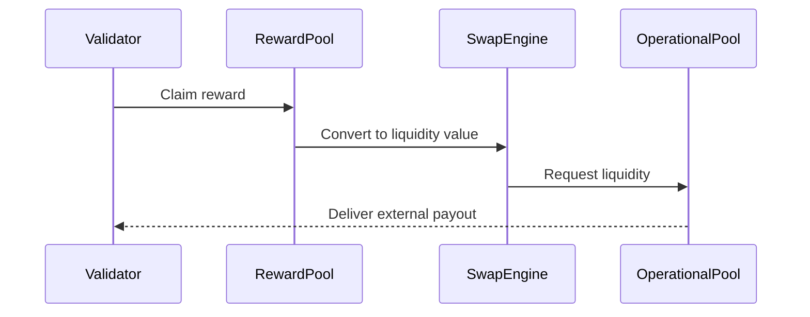

# liquidity_pool_mechanism.md

---

### **📑 Содержание документа:**

```markdown
# Liquidity Pool Mechanism

## 1. Purpose

The Liquidity Pool Mechanism defines how internal liquidity is provisioned, managed, and stabilized within the AST system. Unlike DeFi-style open pools, Aros Liquidity Pools are **non-public, permissioned**, and built for **systemic price integrity**, not speculative trading.

---

## 2. Pool Types

The AST ecosystem uses multiple specialized liquidity pools:

| Pool Type           | Purpose                                                            |
|---------------------|--------------------------------------------------------------------|
| 🔄 Swap Pool        | Enables bridge-based conversion between ArosCoin and external value |
| 💼 Operational Pool | Holds liquidity for system-level buybacks and validator payouts     |
| 🧠 Governance Pool  | Stores liquidity for governance proposals with economic consequences|
| 🔒 Reserve Sync Pool| Synchronizes long-term liquidity ratios for burn/re-mint logic      |

Each pool is isolated at the contract level and cannot interact with external protocols.

---
```

3. Internal Swap Engine

All swap operations are handled by the `InternalSwapEngine` contract:

```solidity
interface IInternalSwapEngine {
    function requestSwap(address user, uint256 amountIn, address tokenOut) external returns (uint256);
    function getPriceQuote(address tokenIn, address tokenOut) external view returns (uint256);
    function provideLiquidity(uint256 amount) external;
}
```

The swap logic is **non-AMM**. Instead of x*y=k models, it uses:

- Static pricing curves
- Time-weighted price bands
- Volume-dependent throttling

---

## **4. Liquidity Cap Enforcement**

To prevent abuse, each pool has:

- Max swap volume per block
- Max pool drain ratio per epoch
- Dynamic cooldown based on demand
- AI-monitored anomaly detection

Liquidity is treated as a **strategic asset**, not a trading opportunity.

---

## **5. Example: Validator Payout Flow**



This process is rate-limited, logged, and rejected if system conditions are breached.

---

## **6. Reserve Sync Behavior**

The system constantly monitors:

- Internal circulation vs. external demand
- Token velocity vs. price volatility
- Historical liquidity drain vs. burn/re-mint cycles

When thresholds are breached, the Reserve Sync Pool:

- Pulls liquidity from operation or buyback pool
- Triggers mint freeze or controlled mint
- Engages governance vote for economic override

---

## **7. Exit Liquidity Guarantee**

Aros maintains **internal exit liquidity** by design:

- All exits must go through contract-governed liquidity requests
- Protocol reserves minimum daily exit liquidity quota
- If unmet, exit is queued with time-based linear unlock
- The Buyback Engine supports this mechanism with price-floor logic

---

## **8. Integration Links**

| **Component** | **Integration Role** |
| --- | --- |
| Tokenization Bridge | Provides external entry liquidity |
| Reverse Bridge | Draws from pools to perform exits |
| Buyback Engine | Buys ArosCoin using liquidity pools |
| Vault System | Releases tokens that may require liquidity backing |
| Governance Layer | Locks liquidity for high-impact proposals |

---

## **9. Design Principle**

> “Liquidity in Aros is not reactive — it is pre-modeled, buffered, and enforced.”
> 

---

## **10. Next Steps**

With pooled liquidity defined, we now describe the **reserve layer and long-term systemic absorption** logic:

- reserve_pool_policy.md
- aroscoin_buyback_mechanism.md