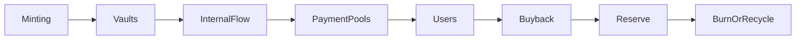

# value_circulation_overview.md

## 1. Purpose

This document outlines the core logic of value circulation within the Aros Studio Tokenomics (AST) system. It defines how ArosCoin is distributed, retained, locked, re-injected, or burned throughout various components of the ecosystem, including Vaults, Pools, Reserve Modules, and Buyback Engines.

The objective of this layer is to ensure:

- Controlled, measurable movement of value
- Predictable liquidity management
- Deliberate supply throttling and velocity control
- Systemic alignment with ArosCoin’s utility and governance purposes

---

## 2. Circulation Architecture

Aros Value Circulation is a modular mechanism composed of the following core structures:

- **Vault System:** Secure storage with time-locked or event-triggered release mechanisms
- **Internal Flow Engine:** Regulates how ArosCoin moves across contracts, services, and payment channels
- **Liquidity Pools:** Dedicated pools for maintaining price stability and immediate liquidity
- **Reserve Module:** Long-term strategic pool governed by protocol-based decisions and emergency logic
- **Buyback Mechanism:** Algorithmic or AI-driven rebuy strategy to extract excess circulation and reinforce price floors

Each of these layers works under predefined contractual rules enforced by smart contracts and validated via the All-Seeing Eye protocol.

---

## 3. Circulation Goals

The circulation design is not speculative. It serves the following explicit functions:

| Function                   | Description                                                                 |
|----------------------------|-----------------------------------------------------------------------------|
| 🔒 Locking Value           | Certain tokens are time-/condition-locked to prevent liquidity overflow     |
| 🔁 Recycling Mechanism     | Internal cycles of payment → vault → release → utility → burn/return         |
| 🧮 Supply Alignment        | Keeps token supply aligned with actual ecosystem activity                   |
| 💧 Liquidity Integrity     | Ensures stable operational liquidity at multiple layers                     |
| 🧠 Governance Rebalance    | Circulates control tokens to reinforce decentralized governance flow         |

---

## 4. Token Lifecycle in Circulation

Each token follows a possible route through issuance → conditional storage → utility flow → user interaction → return or burn.

---

## **5. Integration Points**

The Aros Value Circulation Layer integrates with the following subsystems:

- Token Management Layer — defines locking, issuance, and burn triggers
- NodeChain Engine — triggers token distribution based on validator logic and performance
- Governance Layer — rebalances tokens for voting and proposal initiation
- Security Layer — monitors anomaly-based supply breaches
- Processing Layer — tracks active flow and backlog saturation

---

## **6. Anti-Speculation Stance**

Unlike traditional DeFi ecosystems, ArosCoin is **not freely tradable on public markets by default**. Every unit of token is tracked, validated, and moved according to:

- deterministic triggers
- predefined vault timings
- ecosystem-level protocols

No unmonitored speculation or high-frequency movement is permitted. Every movement is systemic.

---

## **7. Next Steps**

This overview provides a structural base for the following detailed files in 04_aros_value_circulation/:

1. vault_system_design.md
2. aroscoin_internal_flow.md
3. aroscoin_entry_exit_rules.md
4. liquidity_pool_mechanism.md
5. reserve_pool_policy.md
6. aroscoin_buyback_mechanism.md
7. aroscoin_velocity_control.md
8. aroscoin_distribution_tiers.md
9. aroscoin_release_schedule.md
