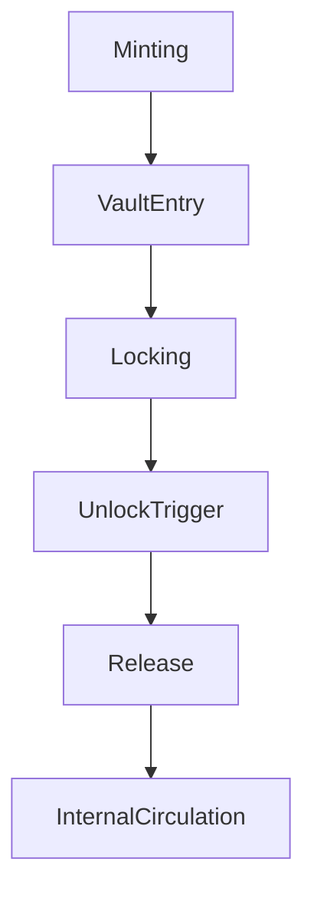

# vault_system_design.md

### **📑 Содержание документа:**

```markdown
# Vault System Design

## 1. Purpose

The Vault System is the structural foundation for retaining, delaying, or restricting the circulation of ArosCoin across the AST ecosystem. It is designed to enforce temporal, behavioral, and conditional boundaries on token flows, ensuring controlled distribution and anti-speculative discipline.

---

## 2. Vault Types

The AST ecosystem supports multiple vault types, each with distinct logic and locking mechanisms.

| Vault Type            | Description                                                                 |
|------------------------|-----------------------------------------------------------------------------|
| 🔒 Time-Locked Vaults   | Tokens are released after a fixed duration (e.g., 6 months)                 |
| 📈 Activity Vaults      | Tokens unlock gradually as system usage thresholds are met                 |
| 🧠 Governance Vaults    | Used to store tokens allocated for voting and proposals                    |
| 🛡️ Security Vaults      | Emergency vaults locked unless protocol breach or attack is detected       |
| 🔁 Reward Cycle Vaults  | Collect and recirculate unused or reclaimed tokens back into ecosystem     |

---

## 3. Vault Lifecycle

```



Each vault has its own smart contract with a state machine that governs:

- Entry (deposit rules)
- Locking state (time-based, condition-based, or multi-factor)
- Unlock triggers (time, events, governance votes, external audits)
- Release path (target module or pool)

---

## **4. Contract Architecture**

Each vault type implements a shared IVaultController interface that includes:

```solidity
interface IVaultController {
    function deposit(address user, uint256 amount) external;
    function isUnlocked(address user) external view returns (bool);
    function release(address user) external;
    function getVaultState(address user) external view returns (VaultState memory);
}
```

Vault contracts are non-upgradable but governed via on-chain policy flags (set at deployment).

---

## **5. Security Rules**

To ensure reliability and resistance to abuse:

- Vault contracts are stateless across user sessions
- Unlock actions are auditable and require quorum where applicable
- Emergency releases are processed via the All-Seeing Eye approval
- Cross-vault movements are prohibited unless routed through internal flow engine

---

## **6. Integration Points**

Vaults interact with the following components:

- Token Management Layer — for tracking locked supply
- NodeChain Engine — for validator-triggered releases (e.g. uptime reward claims)
- Governance Layer — for releasing proposal tokens
- Buyback Engine — for reabsorbing excess from expired vaults

---

## **7. Design Principles**

| **Principle** | **Implementation** |
| --- | --- |
| Immutable Locking | Once locked, token logic cannot be altered externally |
| Deterministic Unlock | Unlock conditions must be pre-defined and externally verifiable |
| Event-Driven Release | Certain vaults release only upon verified trigger events |
| No Self-Dealing | Vaults cannot initiate transfers outside of protocol-defined flows |

---

## **8. Example: Reward Cycle Vault**

```json
{
  "vaultType": "RewardCycle",
  "lockedUntil": "2026-01-01T00:00:00Z",
  "releaseCondition": "Reward not claimed for 90 days",
  "status": "Locked",
  "linkedModule": "InternalFlowEngine"
}
```

---

## **9. Next Steps**

The Vault System acts as the entry barrier and pressure regulator for token movement. Next, we define internal movement patterns and distribution rules in:

- aroscoin_internal_flow.md
- aroscoin_entry_exit_rules.md