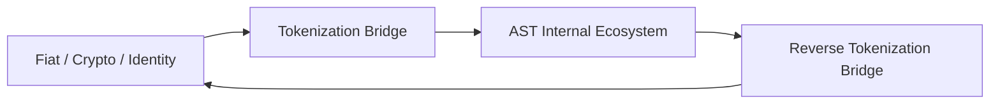

# bridge_layer_overview.md

## 1. Purpose

The Bridge Layer connects the internal AST ecosystem with external environments — including fiat banking systems, other blockchain networks, and authorized external APIs. It governs **how value enters or exits** the system, under strict security, validation, and audit constraints.

Its primary mission is to:
- Maintain sovereignty of ArosCoin while ensuring real-world usability
- Enforce regulatory compliance (KYC/AML) at boundaries
- Prevent unauthorized or speculative transfer across layers
- Guarantee deterministic and auditable transformation of value

---

## 2. Components

The Bridge Layer consists of the following subsystems:

| Component                     | Function                                                              |
|-------------------------------|-----------------------------------------------------------------------|
| 🔁 Tokenization Bridge         | Converts fiat/crypto → ArosCoin (entry into AST)                     |
| 🔄 Reverse Tokenization Bridge| Converts ArosCoin → fiat/crypto (exit from AST)                      |
| 🧾 KYC/AML Interface           | Identity, compliance, and regulatory filtering                       |
| 🔌 Protocol Adapter            | API layer for banking rails, L1/L2 blockchains, and licensed oracles |
| 💧 Bridge Liquidity Router     | Internal liquidity management for inbound/outbound conversions       |
| 🧠 Threat Filter               | AI-based anomaly detection, sanction enforcement, and abuse firewall |

---

## 3. Trust Boundary Model

The Bridge Layer is the **only permitted gateway** for token flows across the AST boundary.

---

## **4. Key Design Constraints**

- No peer-to-peer bridging allowed
- Every transaction must pass through a Compliance Oracle
- Only whitelisted wallets/entities may initiate bridge requests
- All bridge events are logged in an ExternalEventLog
- External protocols must comply with AST contract standards (via adapters)

---

## **5. Security Philosophy**

> “You don’t just cross into Aros. You are admitted, observed, and justified.”
> 
- The bridge layer is **zero-trust by default**
- All inbound value is **quarantined, verified, and unwrapped** before internal minting
- Outbound value is **burned or locked** before external wrapping or fiat payout

---

## **6. Integration Dependencies**

| **Subsystem** | **Interaction** |
| --- | --- |
| Token Management Layer | Controls minting and burning at bridge points |
| Value Circulation Layer | Manages liquidity sync and vault connections |
| Governance Layer | Can authorize or revoke protocol-level bridges |
| Security Layer | Monitors anomaly detection and freeze triggers |
| All-Seeing Eye | Reviews all cross-boundary actions for compliance |

---

## **7. Next Steps**

This document sets the foundation. Each core component is described in detail in the following:

1. tokenization_bridge_architecture.md
2. reverse_tokenization_bridge.md
3. kyc_aml_interface_bridge.md
4. external_protocol_adapter.md
5. bridge_liquidity_routing.md
6. multi_network_bridge_logic.md
7. bridge_threat_model.md
8. bridge_auditability_rules.md
9. bridge_access_control.md
