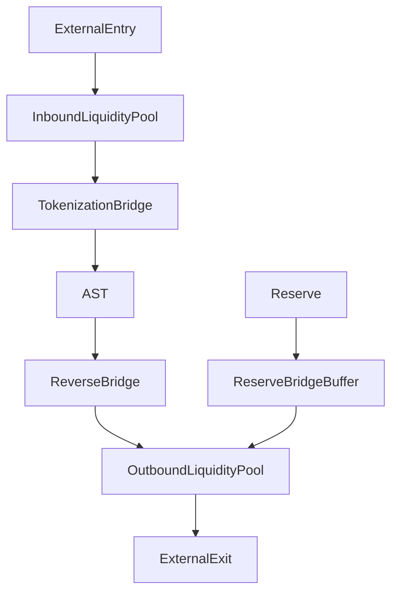

# bridge_liquidity_routing.md

## 1. Purpose

This document defines the internal architecture and logic of **liquidity routing** across bridge operations. Its goal is to ensure that every entry or exit via the Tokenization or Reverse Tokenization Bridge is backed by sufficient, auditable, and policy-compliant liquidity within the AST system.

---

## 2. Core Principles

| Principle                  | Enforcement Mechanism                                       |
|----------------------------|--------------------------------------------------------------|
| 🛑 No Overcommitment       | All bridge operations must be pre-validated against available liquidity |
| 🔒 Isolation per Path      | Tokenization and Reverse flows have separate liquidity pools |
| ⏳ Rate-Controlled Draining| Exits are rate-limited to avoid pool exhaustion              |
| 🔄 Dynamic Rebalancing     | Liquidity is redistributed between pools based on real-time demand |
| 🧠 AI-Governed Forecasting | Flow trends are predicted and pre-buffered                  |

---

## 3. Liquidity Pools

There are three core pools involved in bridge liquidity:

| Pool                      | Description                                                           |
|---------------------------|------------------------------------------------------------------------|
| `InboundLiquidityPool`    | Used for minting ArosCoin against incoming external value             |
| `OutboundLiquidityPool`   | Used for fiat/crypto payouts during exit operations                   |
| `ReserveBridgeBuffer`     | Emergency buffer pool refillable from system reserve or governance    |

All pools are managed as isolated smart contracts and cannot borrow from one another directly.

---

## 4. Routing Logic



Each flow is **single-directional** and fully governed by liquidity quota enforcement logic.

---

## **5. Router Contract**

```solidity
interface IBridgeLiquidityRouter {
    function checkLiquidity(address pool, uint256 amount) external view returns (bool);
    function routeInbound(address user, uint256 amount) external;
    function routeOutbound(address user, uint256 amount) external;
    function rebalancePools() external;
}
```

All routing calls are wrapped with:

- Compliance checks
- Activity score validation
- Real-time pool balance verification

---

## **6. AI Rebalancing Engine**

The All-Seeing Eye AI monitors:

- Bridge load distribution
- Pending exit queues
- Regional entry/exits
- Price and volatility indicators

If imbalance is predicted, the AI triggers rebalancePools() to reallocate liquidity from operational or buyback reserves to maintain stability.

---

## **7. Rate Limiting & Exit Caps**

| **Control Metric** | **Description** |
| --- | --- |
| maxExitPerUser | Prevents user-level liquidity abuse |
| maxExitPerEpoch | Limits total outbound flow across all users |
| cooldownAfterExit | Applies a delay before the next exit request is allowed |
| AIExitFreeze | System-wide shutdown in case of economic anomaly |

These constraints are dynamically adjusted based on liquidity saturation level and flow forecasts.

---

## **8. Emergency Routing Scenarios**

- If OutboundLiquidityPool drops below 25%:
    - ReserveBridgeBuffer is unlocked automatically
    - Governance notified for potential exit quota reduction
    - AI-run simulation adjusts new minting rate to dampen pressure

---

## **9. Integration Points**

| **Component** | **Role** |
| --- | --- |
| Tokenization Bridge | Pulls from InboundLiquidityPool for ArosCoin minting |
| Reverse Tokenization | Pulls from OutboundLiquidityPool for external payouts |
| Reserve Pool | Backfills liquidity when thresholds are breached |
| Buyback Engine | May reduce outbound pressure via parallel absorption |
| Compliance Oracle | Filters participants based on status before routing |
| Governance Layer | May rebalance pool weights or enact emergency measures |

---

## **10. Summary**

> “No bridge without water — no value without backing.”
> 

Liquidity routing is the financial circulatory system of AST’s bridge logic. It protects stability, ensures fairness, and enables long-term operability.

---

## **11. Next Steps**

We now move to the **multi-network logic** for supporting bridging across chains and systems:

- multi_network_bridge_logic.md
