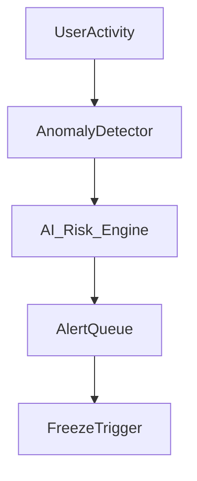

# bridge_threat_model.md (1)

---

### **📑 Содержание документа:**

```markdown
# Bridge Threat Model

## 1. Purpose

This document defines the **security threat model** for the Aros Bridge Layer — including both technical and behavioral vectors — and specifies the defensive architecture designed to mitigate or neutralize them.

The goal is to make the Aros bridge infrastructure:
- Resilient to abuse and exploit
- Transparent to audit and rollback
- Governed by AI + policy consensus
- Non-replicable by untrusted actors

---

## 2. Threat Vectors

| Category         | Example Attack                                      | Risk Level | Mitigation                     |
|------------------|-----------------------------------------------------|------------|--------------------------------|
| 🧑‍💻 External Exploits | Cross-chain reentrancy, RPC spoofing            | High       | Isolated adapters, pre-validation |
| 📊 Economic Abuse  | Liquidity draining via exit queue manipulation    | High       | Exit throttle + AI watchdog    |
| 👥 Sybil Attacks   | Multi-ID minting attempts across bridges          | Medium     | KYC fingerprinting + velocity cap |
| 🪙 Wrapping Drift  | Unsynced mint/burn totals across chains           | High       | Merkle audit + All-Seeing Eye  |
| 🧬 Governance Risk | Malicious adapter activation via quorum rigging   | Medium     | AI override + chain-level veto |
| ⏳ Latency Attack  | Oracle delay spoofing to exploit windowed gaps    | Medium     | Time lock buffers + hash trails |
| 🧾 Compliance Bypass | Masked identity using legal gray-zones          | Medium     | Jurisdictional scoring + partner blacklist |

---

## 3. Core Defenses

### 🔒 Isolation by Design
Each external bridge path is contractually isolated:
- No shared storage
- No fallback routing
- Each route whitelisted and registry-bound

### 🧠 AI-Layer Oversight
The All-Seeing Eye continuously:
- Monitors statistical anomalies
- Validates burn/mint ratios
- Cross-checks timing windows
- Flags pattern-based behavioral risks

### 📈 Dynamic Throttling
All exit and mint flows are capped based on:
- Flow saturation
- Jurisdiction score
- Risk profile of bridge

### ⏹ Freeze Authority
Any component (adapter, chain, user wallet) can be paused by:
- Governance
- AI engine
- Multi-signature council
```

```solidity
function freezeAdapter(address adapter) external onlyAIOrGov;
```

---

## **4. External Auditability**

- All bridge operations are Merkle-tree logged
- Snapshots are hashed and published to independent audit chains
- Mint/burn mismatches above threshold trigger **bridge lockdown**
- Bridge events are replayed through a forensic simulation system weekly

---

## **5. Threat Detection Pipeline**



If a threshold breach is reached, freeze is auto-triggered, and forensic review begins.

---

## **6. Emergency Protocols**

| **Trigger Type** | **Response** |
| --- | --- |
| Mint/Burn Drift | Auto pause of all external bridges |
| Oracle Tampering | Route isolation and backup oracle activation |
| Liquidity Collapse | Emergency Reserve backfill + exit queue freeze |
| Governance Attack | Quorum invalidation + snapshot rollback |

---

## **7. Governance Integration**

- Proposals for new adapters must include:
    - Full threat modeling
    - Simulation test results
    - Jurisdictional review
- Governance overrides can only **lift freezes**, not **bypass threats**
- AI vetoes cannot be revoked except by constitutional quorum

---

## **8. Summary**

> “A bridge is not a doorway. It is a firewall with permission.”
> 

Security is not reactive — it is embedded in every step of the bridging lifecycle.

---

## **9. Next Steps**

We finalize the bridge layer with access control and policy management in:

- bridge_access_control.md