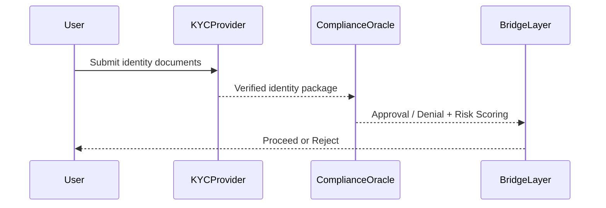

# kyc_aml_interface_bridge.md (1)

---

### **📑 Содержание документа:**

```markdown
# KYC/AML Interface Bridge

## 1. Purpose

This module ensures that all users crossing the AST system boundary (inward or outward) are subject to strict **identity verification** and **compliance filtering**. It acts as a zero-trust gatekeeper for:

- Entry via Tokenization Bridge
- Exit via Reverse Tokenization
- Participation in liquidity, governance, and bridge-based interactions

---

## 2. Compliance Objectives

| Objective               | Description                                                           |
|--------------------------|------------------------------------------------------------------------|
| ✅ Identity Verification  | Confirm real-world legal identity through 3rd-party verification       |
| 🔍 Sanctions Screening    | Screen against global and jurisdiction-specific blacklists             |
| 🌍 Jurisdiction Scoring   | Score risk level of user location and legal environment               |
| 📊 Activity Correlation   | Match declared identity with on-chain activity pattern                |
| 🧾 Tax Status Mapping     | Link withdrawals to tax obligations or reporting frameworks           |

---

## 3. Workflow Overview
```



No bridge operation is allowed unless the user passes ComplianceOracle.approves(user).

---

## **4. Smart Contract Interface**

```solidity
interface IComplianceOracle {
    function approves(address user) external view returns (bool);
    function getJurisdictionScore(address user) external view returns (uint8);
    function isSanctioned(address user) external view returns (bool);
    function recordKYC(address user, bytes32 identityHash) external;
}
```

---

## **5. KYC Provider Integration**

KYC providers must support:

- Document verification (passport, ID, utility bills, etc.)
- Biometric checks (liveness, face match)
- Proof of address
- AML watchlist screening
- Secure callback API to Oracle contract (off-chain to on-chain bridge)

---

## **6. Risk-Based Access Model**

Users are assigned a **Compliance Score**:

| **Score Range** | **Status** | **Permissions** |
| --- | --- | --- |
| 80–100 | Verified | Full access |
| 50–79 | Limited | Throttled participation, lower exit caps |
| <50 | Suspended | Bridge access blocked, full audit required |

The score is dynamic and can change based on:

- Region updates
- Activity anomalies
- Missed reporting obligations

---

## **7. Governance Oversight**

- Governance may approve or revoke certain KYC providers
- Changes to threshold scores require proposal and quorum
- Emergency override available only with AI + Governance joint signal

---

## **8. Privacy Considerations**

- All identity data is hashed and stored off-chain
- On-chain records are only hashes and risk flags
- The All-Seeing Eye monitors for deanonymization risk and enforces minimum privacy rules

---

## **9. Integration Points**

| **Component** | **Role** |
| --- | --- |
| Tokenization Bridge | Requires KYC approval before minting |
| Reverse Tokenization | Requires KYC & AML check before burning & payout |
| Liquidity Router | Verifies KYC before accepting transfer routes |
| Governance Layer | Can impose compliance requirements on proposals |
| All-Seeing Eye | Audits compliance behavior and anomaly trails |

---

## **10. Core Principle**

> “Compliance is not an external layer — it is the architecture of trust itself.”
> 

---

## **11. Next Steps**

We now define the **external system adapter** logic for non-Aros networks:

- external_protocol_adapter.md