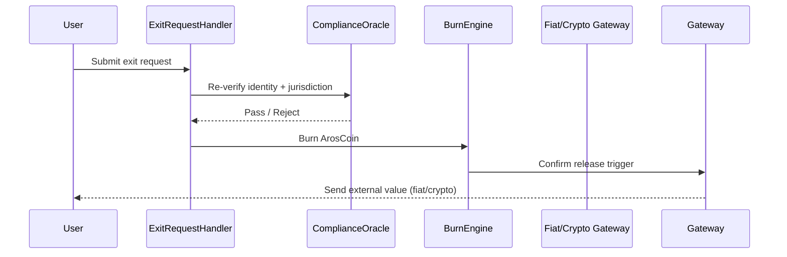

# reverse_tokenization_bridge.md

## 1. Purpose

The Reverse Tokenization Bridge enables controlled **exit** of value from the AST ecosystem by converting ArosCoin into fiat or crypto equivalents. It is the only mechanism through which value can **legally and technically** leave the system.

It ensures:
- Full auditability of outflows
- KYC/AML enforcement
- Transactional throttling
- Fair liquidity usage under cap rules

---

## 2. Exit Flow Overview

Only after compliance and irreversible burn does the system approve value release.



---

## **3. Exit Conditions**

All exits must satisfy:

| **Rule** | **Description** |
| --- | --- |
| ✅ KYC/AML Status | User must pass up-to-date compliance review |
| 🔐 Exit Quota Compliance | Daily/epochal limits per user/jurisdiction |
| 📉 Liquidity Availability | Exit only allowed if pool coverage is > required threshold |
| 🧠 Behavior Profiling | Anomaly-free activity log with no velocity red flags |
| 🧾 Tax & Reporting Conformity | Depending on jurisdiction, external payout requires signed reports |

---

## **4. ExitRequest Smart Contract**

```solidity
interface IExitRequestHandler {
    function requestExit(address user, uint256 amount, string memory targetAsset) external returns (bool);
    function confirmCompliance(address user) external view returns (bool);
    function executeExit(address user) external;
}
```

Only whitelisted users with clean behavior trails may invoke requestExit.

---

## **5. Exit Queue & Throttling**

To protect liquidity and systemic fairness:

- Each user is assigned an ExitScore based on activity profile
- High scores = prioritized exit; low scores = queued with delay
- Exit volume caps are enforced per rolling 24h window
- The system can pause exit if anomaly signals are triggered

---

## **6. Burn Finality Guarantee**

Before any external payout:

- Equivalent ArosCoin is **burned**
- The burn is **Merkle-logged**
- A burn receipt is generated and cross-referenced with BurnLedger

```solidity
function burnAndLog(address user, uint256 amount) external returns (bytes32 receiptHash);
```

This guarantees 1:1 accounting between exit and supply contraction.

---

## **7. External Gateway Transfer**

Upon burn confirmation:

- Fiat is released via licensed banking integration
- Crypto is issued via protocol adapters (e.g. wrapped tokens, stablecoin transfer)
- Each external payout is matched against logged burn proof

All gateway actions are subject to BridgeAuditTrail.

---

## **8. Compliance Snapshot**

Each exit uses a snapshot of:

- Wallet history (last 90 days)
- Region/jurisdiction risk score
- Identity fingerprint (match with KYC provider)
- Velocity and governance engagement

This ensures no malicious actors exit with unfair priority.

---

## **9. Integration Points**

| **Component** | **Role** |
| --- | --- |
| Token Management Layer | Supplies burn engine and monitors circulating supply |
| Reserve Pool | Can cover emergency liquidity shortfall if governance approves |
| Buyback Engine | May redirect exits during strategic withdrawal campaigns |
| All-Seeing Eye | Triggers exit pause if anomaly or manipulation detected |
| Governance Layer | Can redefine exit windows and override policies |

---

## **10. Exit is Not a Right**

> “Exiting the system is not an entitlement — it is a privilege granted by the protocol upon review.”
> 

The system prioritizes integrity over user convenience at the exit boundary.

---

## **11. Next Steps**

Following this, we define the **compliance and identity filtering** logic in:

- kyc_aml_interface_bridge.md
