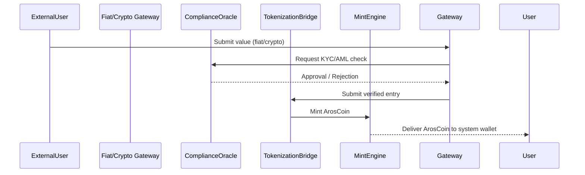

# tokenization_bridge_architecture.md (1)

### **📑 Содержание документа:**

```markdown
# Tokenization Bridge Architecture

## 1. Purpose

The Tokenization Bridge is the controlled entry point for converting external value (fiat or crypto) into ArosCoin within the AST ecosystem. It ensures that all inflows are:
- Verified
- Tracked
- Compliant
- Deterministically minted

---

## 2. Entry Flow Overview
```



All steps must complete successfully for minting to occur. No partial or asynchronous flow is permitted.

---

## **3. Value Types Accepted**

| **Type** | **Notes** |
| --- | --- |
| 💸 Fiat (USD, EUR, TRY, GEL) | Routed via licensed banking gateway |
| 🪙 Stablecoins (USDC, USDT) | Wrapped in contract vault, pre-validated |
| 🧾 Bankwire | Requires unique reference code per user |
| 🔄 On-chain crypto (ETH, BTC) | Only via approved protocol adapter |

All conversions use deterministic exchange rates provided by internal oracles.

---

## **4. Minting Contract**

```solidity
interface ITokenizationBridge {
    function receiveExternalValue(address user, uint256 amount, string memory assetType) external;
    function mintAros(address user, uint256 arosAmount) external;
}
```

Minting is non-reversible and logs the transaction with a unique BridgeMintHash.

---

## **5. Mint Constraints**

- ✅ One mint per identity per epoch (unless authorized otherwise)
- ✅ All transactions must pass ComplianceOracle.isWhitelisted(user)
- ✅ Mint caps apply per jurisdiction and per risk profile
- ✅ Transaction history must be externally auditable

If any validation fails, the minting request is rejected and the value is held in quarantine.

---

## **6. Quarantine Logic**

Suspicious or unverified inflows are routed to the HoldingVault:

```solidity
function quarantine(address user, uint256 amount, string memory reason) external onlyOracle;
```

Only upon resolution can tokens be released or refunded. The HoldingVault is governed by the All-Seeing Eye and cannot be overridden manually.

---

## **7. Compliance Integration**

- KYC/AML verification handled via external plugins (ComplianceOracleAdapter)
- Sanction lists updated daily via oracle feed
- Identity fingerprinting matched against internal activity graphs
- High-risk jurisdictions or wallets are rate-limited or blocked

---

## **8. Monitoring and Logging**

Every minting event logs:

| **Field** | **Description** |
| --- | --- |
| userId | Internal Aros identity |
| externalValue | Fiat or crypto source |
| arosMinted | Amount minted |
| timestamp | UTC datetime |
| jurisdictionTag | Region-based minting flag |
| BridgeMintHash | Unique hash for integrity auditing |

Logs are immutable, Merkle-tree verified, and stored for cross-validation with reverse bridge and buyback entries.

---

## **9. Integration Points**

| **Component** | **Role** |
| --- | --- |
| Governance Layer | Can authorize new bridge providers |
| Vault System | Receives minted ArosCoin in controlled pathways |
| All-Seeing Eye | Reviews inflow anomalies and enforces pause logic |
| Token Management Layer | Controls mint cap and mint throttling |
| External Compliance Feed | Feeds jurisdiction risk and identity metadata |

---

## **10. Next Steps**

With minting entry defined, the next file covers controlled value **exit** via:

- reverse_tokenization_bridge.md