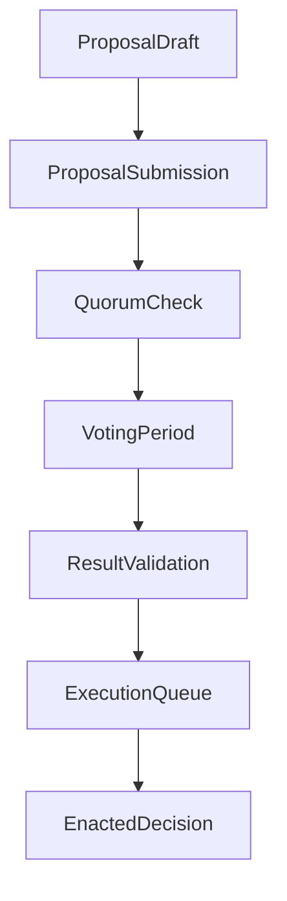

# governance_layer_overview.md (1)

### **📑 Содержание документа:**

```markdown
# Governance Layer Overview

## 1. Purpose

The Governance Layer defines how **decisions are proposed, validated, voted on, and enacted** within the Aros Studio Tokenomics (AST) system. It ensures that control over critical parameters, funding mechanisms, and systemic evolution remains in the hands of **designated actors operating under defined protocols** — not arbitrary automation or centralized discretion.

This layer is designed to:
- Ensure predictability and transparency of decisions
- Create a structured hierarchy of proposal processing
- Balance between decentralization and procedural discipline
- Log every governance action for historical validation

---

## 2. Key Governance Functions

| Function                     | Description                                                              |
|------------------------------|---------------------------------------------------------------------------|
| 🗳 Proposal Handling         | Standardized lifecycle for submitting and managing proposals              |
| 🎯 Voting Execution          | Secure, verifiable on-chain voting process                               |
| 🪙 Governance Token Logic    | Manages voting power, proposal initiation rights, and delegation          |
| 🧮 Quorum Verification       | Ensures that proposals reach participation thresholds before enactment    |
| 🔒 Role-Based Permissions    | Controls who can propose, vote, escalate, or veto                         |
| 🚨 Emergency Procedures      | Allows for protocol-wide overrides under controlled, verifiable rules     |
| 📚 Auditability              | Every action is logged, hashed, and available for independent inspection  |

---

## 3. Governance Model Design

The governance model in AST is **tiered and modular**, with the following principles:

- **Token-Weighted Voting**: Users stake governance tokens to acquire voting rights
- **Proposal Quorum**: No action can be taken unless minimum quorum is met
- **Staged Proposal Lifecycle**: All governance decisions go through clearly defined stages
- **Permission Boundaries**: Only eligible roles may perform certain governance actions
- **Immutable Logging**: All governance actions are traceable and provable via Merkle audit trail

---

## 4. Proposal Lifecycle
```



Each step is enforced by smart contracts and recorded in the Governance Ledger.

---

## **5. Architectural Boundaries**

Governance operates **within** AST only. It does not control external actors, off-chain authorities, or bridges beyond the AST protocol.

Excluded from Governance Layer:

- Lac Musa (meta-architecture validator, not part of AST)
- AI-based management layers (pending design, not integrated)
- Contractual components outside AST (e.g. ALB decisions, external exchanges)

---

## **6. Governance Token Separation**

The governance token is **not ArosCoin**. It is a separate asset:

- Cannot be traded outside the system
- Must be earned, staked, or delegated through defined paths
- Has no monetary or liquidity function beyond proposal interaction

This separation reinforces that governance is a **functional responsibility**, not a speculative privilege.

---

## **7. Integration Points**

| **Component** | **Role** |
| --- | --- |
| Proposal Engine | Hosts proposals, versions, and related metadata |
| Voting Contract | Manages token-weighted voting and validation logic |
| Quorum Evaluator | Assesses proposal legitimacy based on thresholds |
| Permissions Registry | Tracks role capabilities and proposal initiation rights |
| Emergency Handler | Executes overrides when emergency conditions are met |
| Governance Ledger | Stores the immutable record of all actions |

---

## **8. Next Steps**

This document provides an overview. Each governance function will be detailed in the following files:

1. proposal_submission_protocol.md
2. voting_mechanism.md
3. governance_token_logic.md
4. quorum_validation_rules.md
5. governance_roles_and_permissions.md
6. emergency_governance_procedures.md
7. governance_auditability.md