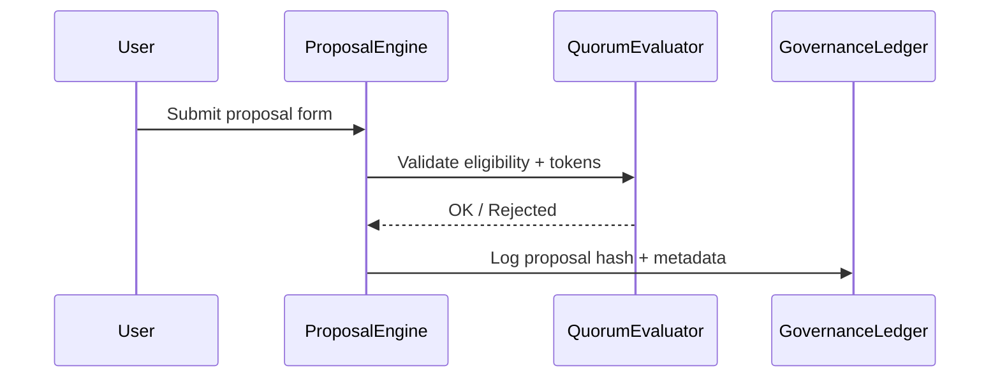

# proposal_submission_protocol.md (1)

---

### 📑 Содержание документа:

```markdown
# Proposal Submission Protocol

## 1. Purpose

This document defines the process by which governance participants in AST may create, submit, and manage proposals. It ensures that all proposals are:

- Authored by eligible actors
- Formatted consistently
- Logged and traceable
- Validated before voting
- Stored with historical versioning

---

## 2. Eligibility Requirements

To submit a proposal, a participant must:

- Hold minimum governance token stake (`minProposalStake`)
- Pass compliance verification (KYC, if required by jurisdiction)
- Not be under governance sanction or active audit
- Not exceed rate-limit for submissions (1 active proposal per user at a time)

The proposal contract checks all requirements before acceptance.

---

## 3. Proposal Structure

Each proposal must follow a defined structure:

| Field              | Description                                                 |
|--------------------|-------------------------------------------------------------|
| `title`            | Short name of the proposal (max 64 characters)              |
| `summary`          | One-paragraph description of purpose and scope              |
| `details`          | Full text, rationale, dependencies                          |
| `impactLevel`      | Declared impact category: `low`, `medium`, `high`, `critical` |
| `actionType`       | `parameter_change`, `role_assignment`, `fund_allocation`, etc. |
| `attachedCode`     | Optional smart contract code or configuration JSON          |
| `timelockWindow`   | Optional delay (in blocks) before execution                  |

Proposals are stored and indexed by `ProposalRegistry`.

---

## 4. Submission Lifecycle
```



Once submitted, proposals cannot be edited — only canceled or superseded by a new version.

---

## 5. Proposal Hashing & Audit Trail

Each proposal is hashed via SHA-3 and stored in the governance ledger:

```solidity
bytes32 proposalHash = keccak256(abi.encodePacked(title, summary, timestamp, user));

```

This ensures:

- Immutable logging
- Compatibility with external audit tools
- Snapshot comparison between proposals

---

## 6. Draft vs Final Proposal

Users may save and revise drafts off-chain, but only **Final Proposals** are:

- Eligible for quorum check
- Visible to other users
- Locked and timestamped on-chain

Submitting a final proposal **burns a small amount of governance tokens** to discourage spam.

---

## 7. Proposal Cancellation

Proposals may be canceled if:

- The author initiates a cancellation before voting begins
- Governance votes to cancel via override
- The proposal is flagged by the Compliance Oracle

Canceled proposals remain in the ledger with status `cancelled`.

---

## 8. Submission Rate Limits

To prevent abuse:

| Control | Value |
| --- | --- |
| `maxActivePerUser` | 1 |
| `minTimeBetween` | 72 hours |
| `maxProposalsDaily` | 100 global |

These values may be adjusted via governance vote.

---

## 9. Integration Points

| Component | Role |
| --- | --- |
| ProposalEngine | Receives and validates submissions |
| QuorumEvaluator | Checks stake and eligibility |
| GovernanceLedger | Stores proposal hashes and metadata |
| VotingContract | Attaches vote logic once proposal is live |
| Compliance Oracle | Flags sanctioned or anomalous submitters |

---

## 10. Next Steps

With submission logic in place, we now define the **voting process** in:

- `voting_mechanism.md`