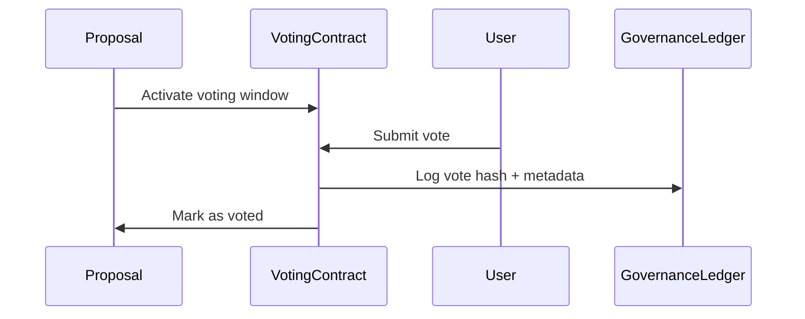

# voting_mechanism.md

## 1. Purpose

This document describes the architecture, process, and validation logic of the voting system in AST Governance Layer. It defines how participants vote, how their votes are weighted, and how outcomes are confirmed or rejected in a transparent, deterministic way.

---

## 2. Voting Eligibility

To vote on a proposal, a participant must:

- Hold a non-expired governance token balance at snapshot
- Not be flagged by the Compliance Oracle
- Not have exceeded vote limits (per epoch, if set)
- Be registered in the Voting Registry

Voting rights are **non-transferable** and **must be actively staked** during the voting period.

---

## 3. Voting Lifecycle



Votes cannot be changed after submission. Voting period is fixed per proposal.

---

## 4. Voting Options

Each proposal allows the following options:

| Option | Meaning |
| --- | --- |
| ✅ `yes` | Support proposal |
| ❌ `no` | Oppose proposal |
| ⏳ `abstain` | Acknowledge but do not affect result |

Votes are counted at the end of the voting window only.

---

## 5. Voting Weight

Weight is determined by:

```
VotingWeight = stakedGovernanceTokens

```

The snapshot is taken at the proposal's activation block. Tokens staked after this block do not count.

---

## 6. Smart Contract Interface

```solidity
interface IVotingContract {
    function submitVote(uint256 proposalId, uint8 option) external;
    function getVoteStatus(address user, uint256 proposalId) external view returns (uint8);
    function countVotes(uint256 proposalId) external returns (VoteResult memory);
}

```

Votes are anonymized on submission and resolved by proposal ID at finalization.

---

## 7. Quorum Check

Once the voting window closes, the system:

1. Verifies if quorum was reached (defined in `quorum_validation_rules.md`)
2. Evaluates outcome (`yes` > `no`)
3. Transitions proposal to `passed` or `failed`
4. Adds result to immutable Governance Ledger

---

## 8. Security & Integrity

- Each vote is hashed and stored:

    ```solidity
    voteHash = keccak256(abi.encodePacked(user, proposalId, option, timestamp));
    
    ```

- All voting interactions are non-upgradable and audit-compliant
- No off-chain vote collection is allowed
- Voting history is exportable and can be verified externally

---

## 9. Integration Points

| Component | Role |
| --- | --- |
| ProposalEngine | Initiates voting window |
| GovernanceLedger | Logs vote events and results |
| QuorumEvaluator | Confirms quorum before execution |
| Compliance Oracle | Filters invalid voters |
| Permissions Registry | Grants or revokes voting rights |

---

## 10. Next Steps

With voting logic defined, we proceed to token roles and governance staking rules:

- `governance_token_logic.md`
