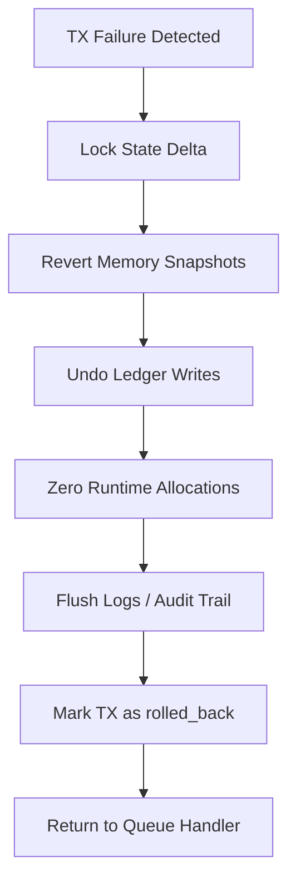

# tx_lifecycle_management.md

## 1. Purpose

This document defines the complete lifecycle management for transactions within AST's internal processing queue, covering both **TTL (Time-to-Live) expiration** and **rollback mechanisms** to ensure data integrity and system reliability.

---

## 2. Transaction TTL Management

### 2.1. What is TTL?

Each transaction may optionally include a metadata tag:

```json
"ttl_seconds": 300
```

This specifies the maximum time (in seconds) the transaction is allowed to remain in the processing queue before automatic expiration. If the TTL expires before dispatch, the transaction is discarded and logged.

### 2.2. TTL Management Loop

A background routine runs every N milliseconds (`ttl_monitor_interval_ms`) to:
1. Iterate over all active queue channels
2. Compare current timestamp with each transaction's entry time + TTL
3. Flag expired entries for removal
4. Write audit logs for expired transactions
5. Remove expired entries from queue buffer or overflow pool

### 2.3. TTL Expiration Effects

Expired transactions are:
- Marked as `status: expired_due_to_ttl`
- Archived to the transaction journal
- Made inaccessible to downstream processors
- NOT forwarded to dispatch or execution

The system guarantees no side effects or partial state changes from expired TXs.

### 2.4. Grace Periods & Special Flags

If a transaction is tagged with:
```json
"ttl_grace_period_ms": 5000
```

Then it remains in a **grace hold** for that duration before hard deletion.
This allows for final inspection or snapshotting before purging.

Additionally, certain high-priority transactions may be tagged as:
```json
"ttl_protected": true
```

Such transactions will bypass automatic TTL expiration, unless explicitly force-expired by system logic.

---

## 3. Rollback Mechanism

### 3.1. When Rollback is Triggered

Rollback is triggered under the following failure conditions:

| Trigger Condition          | Description                                              |
|----------------------------|----------------------------------------------------------|
| `dispatch_error`           | TX fails to be routed or loaded into a context           |
| `execution_failure`        | Runtime exception during TX execution                    |
| `timeout_exceeded`         | TX exceeds max allowed execution time                    |
| `gas_limit_exceeded`       | TX depletes its gas allocation                          |
| `contract_revert`          | TX intentionally reverted by contract logic             |
| `resource_overflow`        | Exceeds memory/CPU/instruction constraints               |
| `manual_intervention`      | TX forcibly cancelled by admin or AI override logic      |

All rollback events are recorded and timestamped for full traceability.

### 3.2. Rollback Flow

```



This rollback cycle is designed to be **deterministic** and **side-effect free**.

## 4. Scope of Reversion

Rollback affects all layers of the execution environment:

| **Layer** | **Rollback Action** |
| --- | --- |
| Smart Contract Runtime | Clears contract state cache, call stack, and temporary memory |
| Ledger Layer | Reverts any committed writes or balance mutations |
| Memory Allocator | Frees all TX-bound allocations |
| Dispatch Layer | Resets queue priority and metadata flags |
| Audit Subsystem | Logs rollback event with trace-level detail |

If **journaling or dispatch state** was partially touched, they are also rolled back using delta reversion snapshots.

## 5. Rollback Snapshot Model

Each TX context includes a rollback-capable snapshot stack:

- On TX load: base snapshot (`S0`) is created.
- Before any critical mutation: `Si` is pushed.
- On failure: rollback engine restores from `Si-1`.
- On commit: all intermediate snapshots are discarded.

This supports multi-layer, nested rollback and ensures **no TX can corrupt runtime state**.

## 6. Audit and Logging

### 6.1. TTL Audit Log Format

Each expired TX is recorded in the audit journal:

```json
{
  "tx_id": "<hash>",
  "expired_at": "ISO8601 timestamp",
  "ttl_seconds": 300,
  "queue_channel": "normalized_tx",
  "grace_period_used": false,
  "was_protected": false
}

```

### 6.2. Rollback Receipt Format

After rollback, a special receipt is logged:

```json
{
  "tx_id": "0x2F7C...",
  "rollback_trigger": "execution_failure",
  "restored_from_snapshot": "S3",
  "rollback_duration_ms": 7,
  "was_partial_commit": false,
  "error_detail": "Divide-by-zero in contract ID:0xA021",
  "rolled_back_at": "2025-06-23T20:41:03Z"
}

```

These receipts are written to `tx_journal_writer` and indexed in the `tx_hash_map_index`.

## 7. Protection from Double Effects

The system prevents re-processing or replay of rolled back TXs:

- **TX hash is moved to tombstone registry**
- **Replay guard flags** mark it as invalid for re-entry
- **Optional dead-letter queuing** may preserve the TX for diagnostics

This guarantees that **failures are final** and safe.

## 8. Special Cases

| **Case** | **Behavior** |
| --- | --- |
| `Batch Execution` | Only the failed TX is rolled back (not the batch) |
| `Nested Calls` | Inner TXs are reverted recursively with parent |
| `Simulated Runs` | No rollback occurs — dry runs are stateless |
| `Forceful Shutdown` | All active contexts perform rollback on shutdown |

The rollback engine is resistant to **process death** and **interruption**, and supports recovery via persistent delta logs.

## 9. Design Guarantees

- TTL logic is idempotent
- Does not interfere with execution layer
- Keeps queue hygiene without manual intervention
- Operates asynchronously from dispatch scheduler
- Guarantees **no side effects** from failed TXs
- Maintains **ledger and memory consistency**
- Ensures **deterministic replays**
- Provides **full auditability** of all failures

## 10. Summary

Transaction lifecycle management in AST combines TTL expiration and rollback mechanisms to create a comprehensive solution for:

- Preventing transaction buildup
- Ensuring system responsiveness
- Enabling deterministic behavior under load
- Maintaining data integrity at all times

This integrated approach is critical to AST's **resilience**, **security**, and **compliance** posture.
