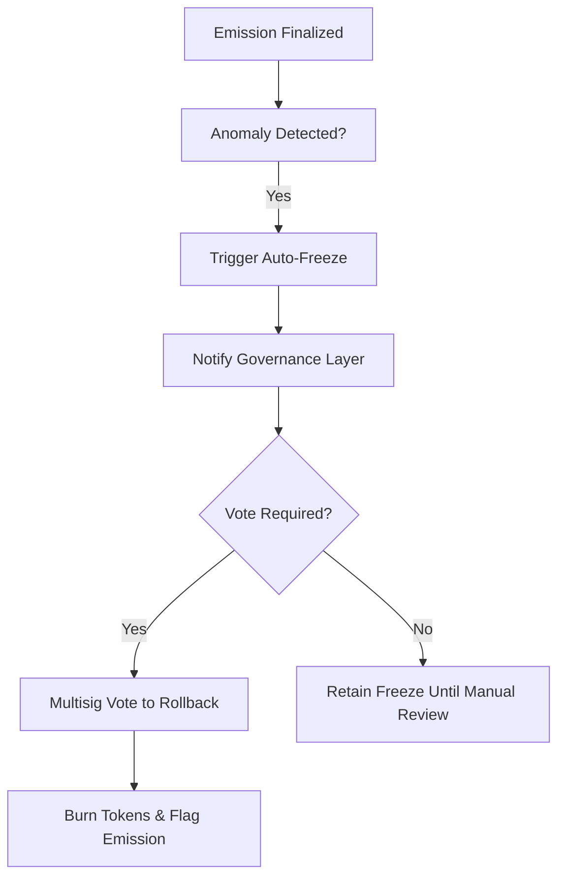

# emission_rollbacks_and_freeze_rules.md (1)

---

```markdown
# 📄 emission_rollbacks_and_freeze_rules.md

## Module: Emission Rollbacks & Freeze Rules
**Layer**: Emission Layer — AST (Aros Studio Tokenomics)
**Status**: Production-grade
**Author**: Aros Studio Blockchain Division
**Last Updated**: 2025-07-05

---

## Overview

This module defines the formal rules and procedures for freezing, reversing, or correcting emission events in AST. While emission is designed to be deterministic and immutable under normal conditions, certain exceptional cases—such as fraud detection, validator malfunction, or governance override—require the ability to halt or undo token generation.

Rollback and freeze logic is bound by strict governance protocol and cryptographic auditability to ensure trust, legal integrity, and protection of token value.

---

## When Rollback or Freeze is Permitted

| Scenario                          | Action Type     | Authority Level          |
|-----------------------------------|------------------|---------------------------|
| Fraudulent Emission Trigger       | **Rollback**     | Multi-sig governance vote |
| Validator Misbehavior             | **Freeze**       | Automatic + Governance    |
| Technical Inconsistency (e.g. hash mismatch) | **Freeze**       | Emission Layer + Observer |
| Over-quota Emission               | **Rollback**     | Epoch Controller          |
| Emergency Regulatory Block        | **Freeze**       | Governance Only           |

---

## Freeze Types

| Type         | Effect                                              |
|--------------|-----------------------------------------------------|
| Soft Freeze  | Prevents emission tokens from leaving origin wallet |
| Hard Freeze  | Tokens are quarantined and marked non-transferable  |
| Audit Freeze | Emission record flagged, pending investigation      |

---

## Rollback Process

1. **Triggering Event Detected**
   - Fraud alert, validator self-report, or governance signal

2. **Emission Record Identified**
   - Based on `emission_id`, associated `tx_id`, and `hash_link`

3. **Governance Review or Auto-Freeze**
   - Auto applies freeze if severe anomaly is detected
   - Governance review initiates rollback vote

4. **Rollback Execution**
   - Minted tokens are burned or reclaimed
   - Emission record status updated to `reversed`
   - All related audit logs are appended with rollback hash

5. **Validator Penalty (if applicable)**
   - Validator staking rewards revoked
   - Node flagged in trace system

---

## Rollback Entry Example

```json
{
  "emission_id": "EM-10788",
  "original_tx_id": "TX-8722-FAKE",
  "status": "reversed",
  "rollback_reason": "Detected double-use of PoT",
  "revoked_amount": 100.0,
  "rollback_signature": "0xREVOKED...",
  "timestamp": 1720251400
}

```

---

## Freeze Enforcement Flow



---

## Dependencies

- `emission_reporting_and_traceability.md`
- `governance_layer.md`
- `tx_journal_writer.md`
- `proof_of_transaction_engine.md`
- `epoch_allocation_model.md`

---

## Final Notes

- Rollback events are **rare and exceptional**
- All freezes and reversals are permanently logged
- Affected tokens become unspendable immediately
- Hash integrity must be reverified after rollback
- Public logs expose all rollbacks via `/emission/rollback/{id}`

---

```

```