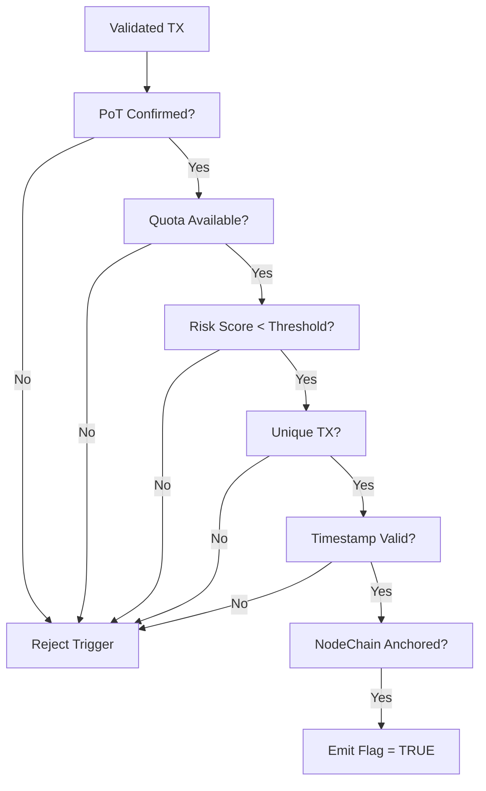

# emission_trigger_conditions.md

## Module: Emission Trigger Conditions
- **Layer**: Emission Layer — AST (Aros Studio Tokenomics)
- **Status**: Production-grade
- **Author**: Aros Studio Blockchain Division
- **Last Updated**: 2025-07-05

---

## Overview

This module defines the precise set of conditions under which an emission event can be legally and technically triggered within the AST system. Emission is never spontaneous — it is initiated only when a qualifying transaction or batch satisfies predefined requirements for legitimacy, risk level, and systemic alignment.

---

## Core Emission Triggers

Emission can only be triggered when **all** of the following are satisfied:

| Condition                         | Description |
|----------------------------------|-------------|
| ✅ Validated PoT Event            | Transaction or batch must pass the Proof of Transaction attestation |
| ✅ Emission Quota Available       | Epoch-specific or shard-level ceiling has not been reached |
| ✅ Risk Score Within Threshold    | Aggregated risk must be below defined emission-safe limits |
| ✅ Transaction Not Previously Used| TX must not be already linked to another emission event |
| ✅ Timestamp Within Valid Window  | TX must fall within the emission-active epoch and time frame |
| ✅ NodeChain Sync Confirmed       | TX lineage must be anchored in a confirmed NodeChain segment |
| ✅ No Active Freeze on Token Type | Token involved in TX must not be under freeze or emergency block |

---

## Conditional Exceptions (Governance Controlled)

Governance or emergency override may permit emission in special cases:

| Exception Type         | Authority Level Required      |
|------------------------|-------------------------------|
| Treasury Re-activation | Multi-sig governance quorum   |
| Emergency Liquidity    | Supernode + fraud-verified    |
| Post-Audit Reinstatement | Dual-node forensic approval |

These exceptions are **logged separately** and must include full trace context.

---

## Emission Blacklist Logic

Certain transactions are **automatically disqualified** from triggering emission:

- Transactions marked as `simulated = true`
- Transactions from wallets on emission blacklist
- Transactions from nodes in deactivated shard segments
- Transactions with retroactive timestamp beyond rollback window

---

## Trigger Evaluation Pipeline

1. Receive validated transaction from `Processing Layer`
2. Lookup NodeChain lineage and PoT hash
3. Verify eligibility based on epoch, quota, and token type
4. Calculate cumulative risk score from attached metadata
5. Check for historical emission linkage
6. If all checks pass → mark TX as **“emission-capable”**

---
```

---


---


## Output Example

```json
{
  "tx_id": "TX-90384-EM",
  "eligible_for_emission": true,
  "evaluated_by": "AST-ND-07",
  "reason": null,
  "risk_score": 0.14,
  "emission_epoch": 195
}

```

If rejected:

```json
{
  "tx_id": "TX-90384-EM",
  "eligible_for_emission": false,
  "reason": "Quota exceeded in epoch 195",
  "evaluated_by": "AST-ND-07"
}

```

---

## Dependencies

- `proof_of_transaction_engine.md`
- `epoch_allocation_model.md`
- `nodechain_hash_map_index.md`
- `tx_validation_pipeline.md`
- `risk_score_model.md`

---

## Next

→ See [`emission_flow_pipeline.md`](https://www.notion.so/aros-studio/emission_flow_pipeline.md) for how eligible transactions are processed into real minted tokens.
