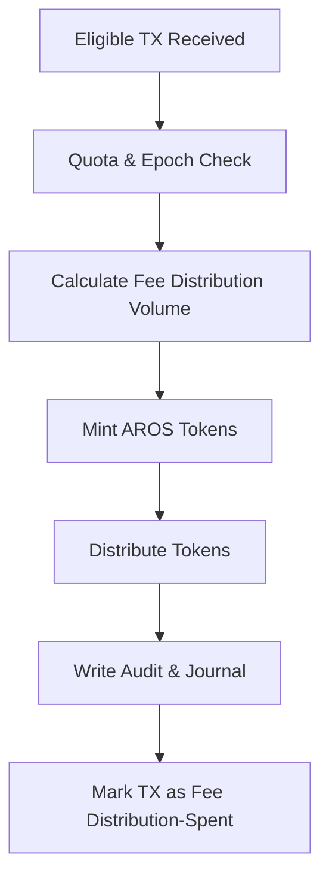

# emission_flow_pipeline.md

## Module: Fee Distribution Flow Pipeline
- **Layer**: Fee Distribution Layer — AST (Aros Studio Tokenomics)
- **Status**: Production-grade
- **Author**: Aros Studio NodeChain Division
- **Last Updated**: 2025-07-05

---

## Overview

This module defines the full technical lifecycle of an emission event, from eligibility confirmation to the controlled minting and allocation of ArosCoin (AROS). The pipeline guarantees deterministic emission behavior, traceability, and alignment with epochal, shard-level, and governance-defined constraints.

---

## Stages of the Fee Distribution Pipeline

| Stage | Name                         | Description |
|-------|------------------------------|-------------|
| 1     | Trigger Acknowledgment       | A PoT-validated transaction is marked as eligible |
| 2     | Epoch & Quota Check          | Ensures emission volume is within current epoch limits |
| 3     | Fee Distribution Volume Calculation  | Computes how many tokens to emit based on predefined models |
| 4     | Minting Phase                | Creates new AROS tokens under controlled and locked state |
| 5     | Distribution Routing         | Assigns tokens to destination wallets (nodes, treasury, etc.) |
| 6     | Finalization & Logging       | Updates audit log, emission ledger, and hash index |

---

## Detailed Flow

### 🔹 1. Trigger Acknowledgment

The `emission_trigger_conditions.md` module flags a TX as eligible. This signal enters the Fee Distribution Pipeline.

### 🔹 2. Epoch & Quota Check

- Validates that the current emission epoch has not exceeded its cap
- Ensures that the shard or domain of origin has remaining capacity
- If limit is reached → TX is queued for next epoch or rejected with `QUOTA_REACHED`

### 🔹 3. Fee Distribution Volume Calculation

Based on one or more of the following:
- Fixed token-per-TX ratio (e.g., 1 AROS per 1 PoT)
- Risk-adjusted scaling (lower risk = higher emission weight)
- Dynamic policy-based coefficients (e.g., emergency dampening)

> Formula (example):
> `emission_amount = base_amount * risk_modifier * policy_coefficient`

### 🔹 4. Minting Phase

- Creates AROS tokens in a locked state
- Locks may include time-lock, governance review, or transaction confirmation conditions
- All minted tokens are immediately hash-mapped for audit

### 🔹 5. Distribution Routing

Token allocation performed using one of the following models:
- Validator payment split (e.g., 60% to confirming node, 40% to treasury)
- NodeChain round-based rotation
- Governance treasury replenishment
- Shard-local redistribution

### 🔹 6. Finalization & Logging

- Entry added to `tx_journal_writer`
- Fee Distribution hash linked to `tx_hash_map_index`
- Fee Distribution recorded in `emission_reporting_and_traceability.md`
- Trigger TX is marked as "spent" for emission purposes

---

## Mermaid Diagram



---

## Example Output (Post-Fee Distribution Record)

```json
{
  "emission_id": "EM-10299",
  "source_tx": "TX-90384-EM",
  "emission_epoch": 195,
  "minted_amount": 125.00,
  "risk_score": 0.14,
  "distribution": {
    "validator": "0xA12B...",
    "treasury": "0xF91D..."
  },
  "timestamp": 1720251225,
  "status": "finalized"
}

```

---

## Dependencies

- `emission_trigger_conditions.md`
- `epoch_allocation_model.md`
- `tx_journal_writer.md`
- `tx_hash_map_index.md`
- `emission_reporting_and_traceability.md`

---

## Next

→ See [`epoch_allocation_model.md`](https://www.notion.so/aros-studio/epoch_allocation_model.md) for how token distribution is regulated across epochs and policy constraints.
