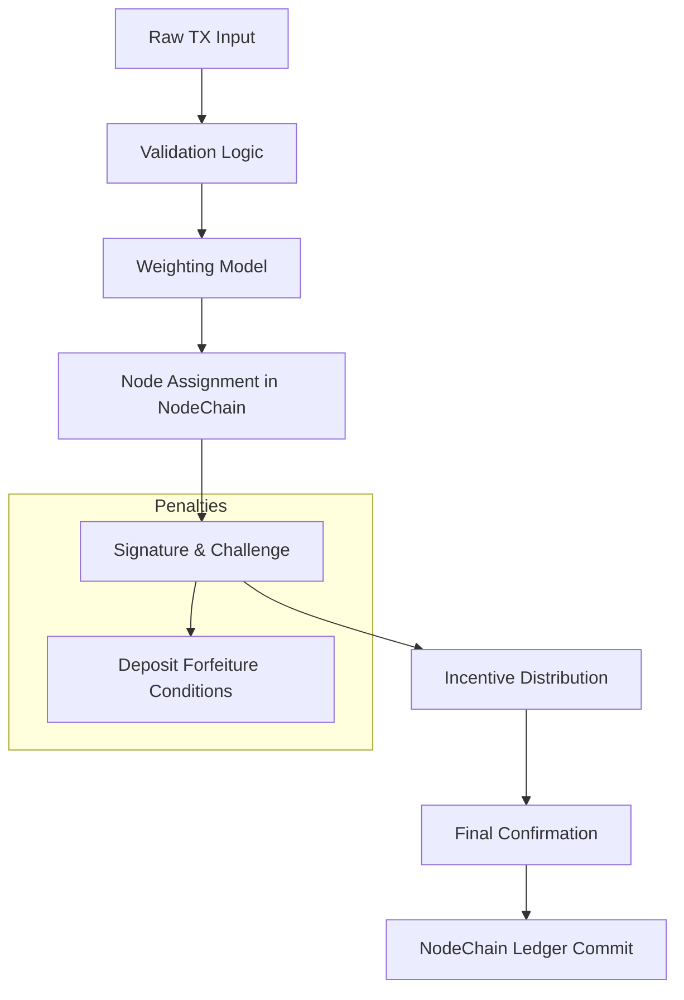

# Proof of Transaction Engine: Full Overview

**Module:** AST — Aros Studio Tokenomics  
**Component:** Proof of Transaction Engine (PoT)  
**Status:** Draft  
**Author:** AROS Studio  
**Date:** 2025-08-24  

## 1. Purpose of the Module
The Proof of Transaction Engine is the architectural and functional core of the AST transaction confirmation system. Unlike traditional consensus algorithms such as Proof of Work (PoW) or Proof of Stake (PoS), this engine is based on a different paradigm: **Proof of Transaction (PoT)**. The principle behind PoT is that validation power must arise from **activity**, **integrity**, and **transactional contribution**, all within the NodeChain framework for decentralized validation.

The module is responsible for:
- Analyzing, evaluating, and confirming transaction validity in NodeChain.
- Assigning validation rights to nodes based on actual behavior and context.
- Executing weight calculations and final confirmation.
- Writing results to the immutable ledger for transparency and audit, with privacy safeguards.

As UX Researcher, PoT enables seamless micro-transactions for urban services (e.g., city payments). As Revenue Model Architect, it ties revenue to real TX fees.

## 2. Core Principles
### 1. Transaction-Centric Validation
Validation is rooted in the transaction's inherent value and context, integrated with NodeChain sharding.

### 2. Behavioral Reputation
Nodes earn "weight" through consistent, honest participation in NodeChain, penalized for deviations.

### 3. Deterministic and Auditable
All PoT processes are replayable and logged immutably, compliant with GDPR.

### 4. Integration with AST
Triggers emission (08_emission_layer/) and payments (11_validator_staking_payments/), escalating to AI agents for anomalies.

## 3. High-Level Flow

## 4. Key Metrics
- Validation Time: <100ms per TX in NodeChain.
- False Positive Rate: <0.1% (tuned via AI agents).

## 5. Dependencies
- 07_processing_layer/tx_validation_pipeline.md (TX intake).
- 02_nodechain_engine/node_registration_and_auth.md (node pool).
- 06_governance_layer/governance_roles_and_permissions.md (overrides).
- 13_extra_supervisory_layer/anomaly_detection_patterns.md (monitoring).

## 6. Open Notes
- Future: Integrate zero-knowledge proofs for privacy-enhanced validation in NodeChain.
- Audit Recommendation: Formal verification of weighting formulas, aligned with EIB standards.
