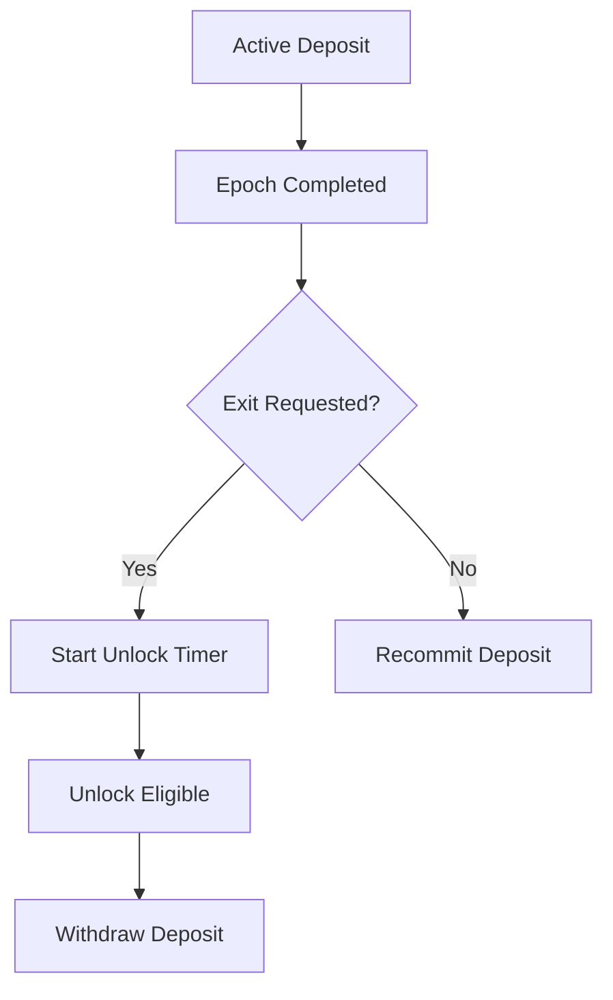

# deposit_freeze_unlock_rules.md 

## Module: Deposit Freeze & Unlock Rules
- **Layer**: Validator Node Security Deposit & Payment System — AST (Aros Studio Tokenomics)
- **Status**: Production-grade
- **Author**: Aros Studio NodeChain Division
- **Last Updated**: 2025-07-05

---

## Overview

This module defines the lifecycle of validator deposit once locked in the network. It covers freezing mechanics, unlocking procedures, withdrawal rules, and event-driven state changes. Depositd funds are treated as locked collateral — bound to validator duties and performance — and cannot be freely moved unless specific criteria are met.

---

## Deposit Lock Lifecycle

| Stage               | Description |
|---------------------|-------------|
| `Pending`           | Deposit submitted but not yet bound to an epoch |
| `Active`            | Deposit linked to a validator’s epoch commitment |
| `Frozen`            | Temporarily locked due to violation or investigation |
| `Unlocked`          | Eligible for withdrawal after exit conditions met |
| `Forfeited`           | Deposit partially or fully burned for violation |

---

## Unlock Conditions

| Condition                      | Outcome |
|--------------------------------|---------|
| Epoch commitment completed     | Deposit moves from `Active` → `Unlocked` |
| Voluntary exit request         | Initiates delay timer (1 epoch min) |
| Governance-approved withdrawal | Immediate unlock, bypasses delay |
| Performance drop < threshold   | Triggers `Frozen` state until reviewed |

---

## Freeze Triggers

- Attestation failure (3× in one epoch)
- Node goes offline > 60 minutes during active epoch
- Deposit tampering or unauthorized smart contract access
- Governance audit signal
- Technical anomaly detection via NodeChain AI

---

## Freeze Consequences

| Type         | Effect |
|--------------|--------|
| Soft Freeze  | Payments suspended, deposit remains locked |
| Hard Freeze  | Deposit frozen + validator removed from active list |
| Investigative Freeze | Pending decision by governance vote |

---

## Unlock Flow
```

---



## Deposit Exit Request

```json
{
  "validator": "0xA4398...",
  "epoch_end": 2914,
  "unlock_requested": true,
  "unlock_timestamp": 1720398800,
  "status": "pending_unlock"
}

```

---

## Governance Hooks

- Manual override possible via `/governance/deposit/forceUnlock`
- Forfeited deposit enters audit ledger via `tx_audit_log_format`
- Frozen deposit can be restored via vote (`unfreezeDeposit(address)`)

---

## Smart Contract Functions

| Function | Purpose |
| --- | --- |
| `freezeDeposit(address)` | Temporarily lock validator’s deposit |
| `unlockDeposit(address)` | Move deposit to withdrawal-ready status |
| `withdrawDeposit(address)` | Finalize removal of unlocked deposit |
| `forfeitDeposit(address)` | Burn portion or full deposit |
| `getDepositState(address)` | Return current deposit lifecycle stage |

---

## Dependencies

- `security deposit_overview.md`
- `validator_registration.md`
- `validator_epoch_commitments.md`
- `security deposit_governance_interface.md`

---

## Next

→ See [`validator_epoch_commitments.md`](https://www.notion.so/aros-studio/validator_epoch_commitments.md) to understand how deposit is assigned and bound to specific validation periods.
