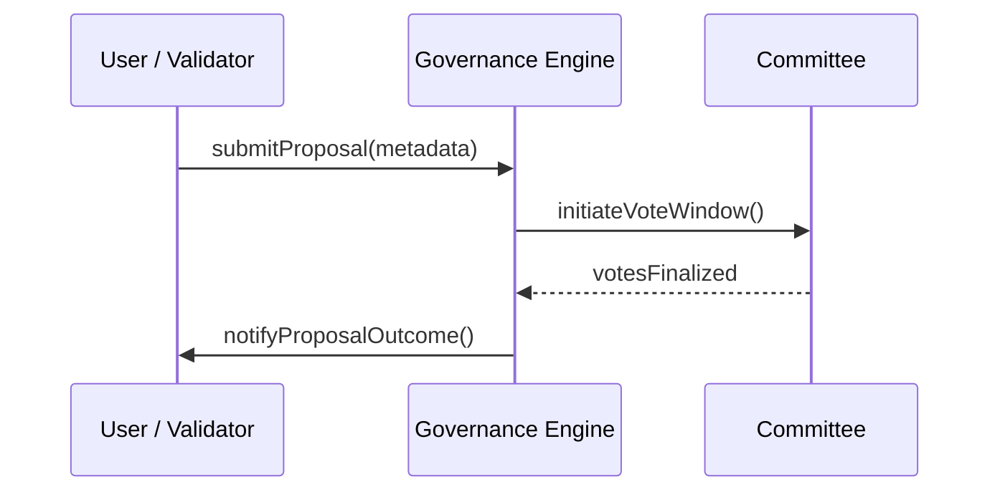

# security deposit_governance_interface.md 

## Module: Node Security Deposit Governance Interface
- **Layer**: Validator Node Security Deposit & Payment System — AST (Aros Studio Tokenomics)
- **Status**: Production-grade
- **Author**: Aros Studio NodeChain Division
- **Last Updated**: 2025-07-05

---

## Overview

This module defines the governance API layer through which validators, protocol agents, and governance actors interact with the security deposit and forfeiting subsystems of the AST protocol. It provides a structured interface for submitting appeals, voting on forfeiting proposals, adjusting security deposit rules, and executing governance decisions that affect validator status or emission parameters.

---

## Interface Scope

| Endpoint                          | Purpose |
|-----------------------------------|---------|
| `/governance/proposal/create`     | Submit a new governance proposal |
| `/governance/proposal/vote`       | Cast vote on existing proposal |
| `/governance/appeal`              | Submit forfeiting appeal |
| `/governance/validator/override`  | Force-add/remove validator |
| `/governance/epoch/modify`        | Change epoch duration or settings |

---

## Proposal Lifecycle



---

## Voting Rules

| Rule | Value |
| --- | --- |
| Quorum Threshold | 51% of active committee |
| Approval Ratio | ≥ 66% of quorum |
| Voting Window Duration | 72 hours |
| Emergency Override Quorum | 75% validator vote |
| Governance Token Required | Yes (1 vote = 1 GOVTKN) |

---

## Appeal Interface

Validators can appeal forfeiting actions through the `/governance/appeal` endpoint. Required fields:

```json
{
  "validator_id": "V-8823",
  "epoch": 2044,
  "reason": "node compromise by external agent",
  "evidence": {
    "logs": "...",
    "metadata_snapshot": "...",
    "witness_signatures": ["0xA23...", "0xB54..."]
  }
}

```

Appeals are routed to the Forfeiture Review Committee and must be decided within 96 hours.

---

## Validator Override

Governance has the ability to override validator status via:

- Emergency removal (e.g. threat to consensus)
- Temporary admission of new validator during fork recovery
- Resurrecting forfeited validator on successful appeal

All overrides are logged with audit hash and timestamp.

---

## API Security & Logging

- Every action is cryptographically signed
- All governance actions are hashed and time-stamped
- Forfeiture actions require multi-sig governance key (≥ 3-of-5)
- All decisions logged to `governance_ledger` contract

---

## Smart Contract Bindings

| Function | Purpose |
| --- | --- |
| `submitGovernanceProposal()` | Register proposal metadata on-chain |
| `castVote(proposalId, vote)` | Vote for or against proposal |
| `overrideValidator(address)` | Add or remove validator |
| `submitForfeitureAppeal()` | Appeal a forfeiting event |
| `adjustEpochParameters()` | Modify epoch duration and rules |

---

## Governance Events Feed (Sample)

```json
{
  "event": "proposal_passed",
  "proposal_id": "PR-2291",
  "title": "Increase Epoch Duration to 10 days",
  "votes_for": 3242,
  "votes_against": 88,
  "quorum_met": true,
  "executed": true,
  "timestamp": 1720939922
}

```

---

## Dependencies

- `forfeiting_and_penalty_rules.md`
- `validator_epoch_commitments.md`
- `payment_distribution_engine.md`

---

## Final Note

The governance interface enables AST to remain adaptable and secure, while preserving validator rights and community oversight. All interactions through this API are audit-bound and permanently anchored to AST’s immutable governance ledger.

```

```
