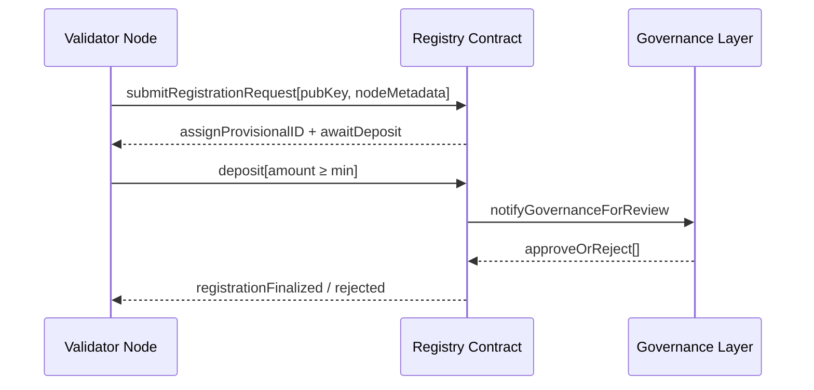

# validator_registration.md

## Module: Validator Registration
- **Layer**: Validator Node Security Deposit & Payment System — AST (Aros Studio Tokenomics)
- **Status**: Production-grade
- **Author**: Aros Studio NodeChain Division
- **Last Updated**: 2025-07-05
---

## Overview

This document outlines the formal registration procedure for becoming a validator in the AST network. Validators must undergo identity provisioning, deposit verification, epoch scheduling, and key binding prior to participating in any transaction validation or attestation.

---

## Eligibility Criteria

| Requirement                  | Detail |
|------------------------------|--------|
| Deposit Commitment             | ≥ 10,000 AROS |
| Unique Node Identity         | Enforced via cryptographic keypair |
| Network Reachability         | Must expose gRPC + REST ports |
| Performance Baseline         | Must pass testnet trial or benchmark |
| Governance Acceptance        | Must not be in denied registry |

---

## Registration Workflow


## Node Metadata Schema

```json
{
  "node_name": "Node-Alpha-117",
  "location": "DE-FRA",
  "operator_pubkey": "0xB1A2...",
  "contact_email": "node@alpha.org",
  "version": "AST-Core/v1.2.4",
  "infra_provider": "BareMetal",
  "jurisdiction": "EU"
}

```

---

## Finalization Logic

Once governance approval is received, the validator must:

1. Complete signature handshake for private key validation
2. Acknowledge forfeiting policy and binding agreements
3. Be scheduled into next open epoch by Epoch Controller
4. Receive validator ID (VID) and node hash

---

## Key Contracts & Functions

| Contract | Function | Purpose |
| --- | --- | --- |
| ValidatorRegistry | `submitRegistration()` | Accepts new validator metadata |
| Node Security DepositContract | `deposit()` | Locks required AROS |
| GovernanceBridge | `approveValidator(address)` | Confirms validator approval |
| EpochScheduler | `assignEpoch(address)` | Assigns node to epoch window |

---

## Rejection Criteria

- Duplicate node identity
- Use of banned infrastructure (e.g. TOR nodes, VPN chains)
- Jurisdictional conflict (e.g. sanctions list)
- Failure to deposit within 12 hours
- Governance rejection after metadata analysis

---

## Public API for Validators

| Endpoint | Method | Description |
| --- | --- | --- |
| `/validator/register` | POST | Submit validator registration |
| `/validator/status/{address}` | GET | Query current registration status |
| `/validator/metadata/{vid}` | GET | Retrieve public node metadata |
| `/validator/list/active` | GET | List all active validators |

---

## Dependencies

- `security deposit_overview.md`
- `deposit_freeze_unlock_rules.md`
- `validator_epoch_commitments.md`
- `security deposit_governance_interface.md`

---

## Next

→ See [`deposit_freeze_unlock_rules.md`](https://www.notion.so/aros-studio/deposit_freeze_unlock_rules.md) to learn how depositd funds are locked, released, or penalized.

```

```
