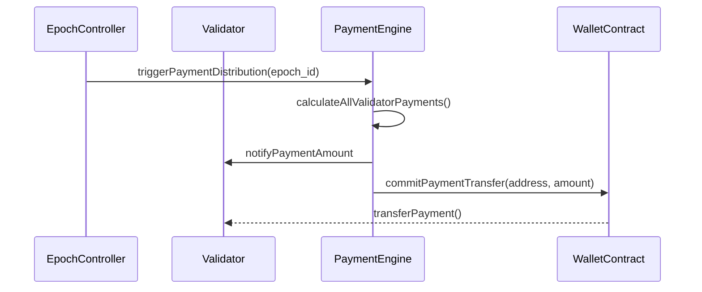

# payment_distribution_engine.md

## Module: Payment Distribution Engine

- **Layer**: Validator Staking & Payment System — AST (Aros Studio Tokenomics)
- **Status**: Production-grade
- **Author**: Aros Studio Blockchain Division
- **Last Updated**: 2025-07-05

---

## Overview

This module defines the mechanism for calculating and distributing payments to validators participating in Proof of Transaction (PoT) within AST epochs. The payment engine ensures proportional, fair, and performance-sensitive allocation of emission units.

---

## Payment Composition

| Component                | Description |
|--------------------------|-------------|
| `Base Epoch Payment`      | Fixed emission allocation for each epoch |
| `Stake Weight`           | Validator's stake relative to total active stake |
| `Performance Modifier`   | Score from validator performance engine |
| `Penalty Adjustments`    | Deducted for downtime, fraud, or missed attestations |

---

## Payment Calculation Formula

```text
validator_payment = epoch_(payout|settlement)_pool
                 × (validator_stake / total_stake)
                 × performance_score
                 - penalties

```

- `performance_score` ∈ [0.0, 1.0]
- `penalties` dynamically computed based on epoch audit logs

---

## Distribution Process



---

## Payment Frequency

| Event | Trigger |
| --- | --- |
| `Epoch End` | Every 7 days (default) |
| `Manual Override` | Governance may issue early or delayed payments |
| `Emergency Payout` | In case of chain fork recovery |

---

## Penalty Impact

| Violation Type | Impact on Payment |
| --- | --- |
| Missed Attestations | −15% per event |
| Fraudulent Signature | −100%, trigger slashing |
| Downtime > 5% | −30% penalty |
| Metadata Manipulation | Blocked payment |

---

## Payment Types

| Type | Description |
| --- | --- |
| `AROS-Emission` | Standard validator payments in AROS |
| `Reputation Points` | Non-transferable points for governance rank |
| `Epoch Bonus` | Randomized incentive pools for top performers |

---

## Smart Contract Functions

| Function | Description |
| --- | --- |
| `distributePayments(epochId)` | Launch payment distribution for the given epoch |
| `getPaymentDetails(address)` | View payment breakdown for validator |
| `applyPenalty(address)` | Apply deduction based on audit log |
| `setPerformanceScore(address, score)` | Register validator performance rating |

---

## Data Anchoring

Each payment event is linked to:

- Epoch ID
- Block Height
- Validator ID (VID)
- Node Hash
- JSON Report Snapshot

Sample Report:

```json
{
  "epoch": 3912,
  "vid": "V-00928",
  "payment": 823.71,
  "penalties": 1,
  "final_score": 0.89,
  "tx_hash": "0x09AF...",
  "block": 18200123
}

```

---

## Dependencies

- `validator_epoch_commitments.md`
- `validator_performance_score.md`
- `slashing_and_penalty_rules.md`
- `emission_flow_pipeline.md`

---

## Next

→ See [`validator_performance_score.md`](https://www.notion.so/aros-studio/validator_performance_score.md) to understand how scores are calculated and impact payment allocation.
