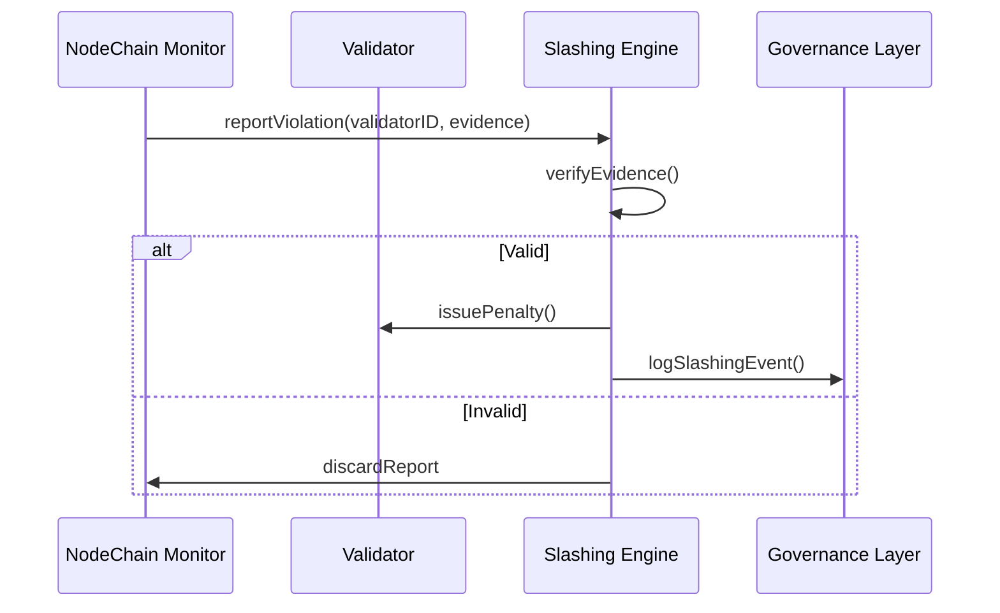

# slashing_and_penalty_rules.md 

## Module: Slashing and Penalty Rules
- **Layer**: Validator Staking & Payment System — AST (Aros Studio Tokenomics)
- **Status**: Production-grade
- **Author**: Aros Studio NodeChain Division
- **Last Updated**: 2025-07-05
---

## Overview

This module defines the mechanisms for detecting, enforcing, and recording penalties — including full or partial slashing of validator stake — within the AST network. The slashing engine ensures validator accountability by punishing harmful, negligent, or malicious behavior.

---

## Types of Penalties

| Type                   | Description |
|------------------------|-------------|
| `Soft Penalty`         | Temporary payment reduction or epoch suspension |
| `Hard Penalty`         | Permanent stake loss (partial or full) |
| `Governance Slash`     | Triggered via governance override vote |
| `Fraud Detection Slash`| Automated slashing based on NodeChain evidence |

---

## Slashing Triggers

| Violation                       | Severity | Default Penalty |
|----------------------------------|----------|------------------|
| Missed ≥3 attestations / epoch   | Medium   | −25% stake |
| Downtime > 20% of epoch runtime  | Medium   | −30% payment |
| Fraudulent signature             | Critical | −100% stake |
| Tampering with metadata          | High     | −50% stake |
| Repeated underperformance        | Medium   | −10% per epoch |
| Disobeying governance resolution | Critical | Immediate kick + stake burn |

---

## Enforcement Pipeline



---

## Stake Burn Formula

```
burn_amount = validator_stake × penalty_ratio

```

Where `penalty_ratio` ∈ [0.0, 1.0], as defined per violation.

---

## Appeal Process

- Slashed validators may appeal via `/governance/appeal`
- Review committee votes based on log records and metadata snapshots
- Successful appeal → partial refund, flag cleared
- Failed appeal → blacklist + cooldown (5 epochs)

---

## Governance Safeguards

| Rule | Description |
| --- | --- |
| `Multi-signature Override` | Manual slash requires ≥ 66% validator vote |
| `Audit Snapshot Lock` | Slashing must reference immutable audit hash |
| `Cooldown Enforcement` | Slashed node cannot re-register for N epochs |
| `Penalty Disclosure` | All events publicly logged in payment engine |

---

## Smart Contract Functions

| Function | Description |
| --- | --- |
| `slashStake(address, amount)` | Burn specific amount of validator stake |
| `logViolation(vid, data)` | Record violation in audit trail |
| `blockValidator(address)` | Disable validator permanently |
| `appealSlashing(address)` | Submit appeal for slashing decision |

---

## Audit Anchors

Each slashing event includes:

- Epoch ID
- Slashing reason code
- Validator ID
- Audit hash
- Timestamp
- Governance signature (if manual)

Example:

```json
{
  "epoch": 4032,
  "vid": "V-19284",
  "penalty": "fraud_signature",
  "amount": 10000,
  "audit_hash": "0xB91D...",
  "timestamp": 1720834123
}

```

---

## Dependencies

- `validator_performance_score.md`
- `payment_distribution_engine.md`
- `staking_governance_interface.md`

---

## Next

→ See [`staking_governance_interface.md`](https://www.notion.so/validator_api/staking_governance_interface.md) to understand how governance resolutions and appeals are handled through the validator API.

```

```
