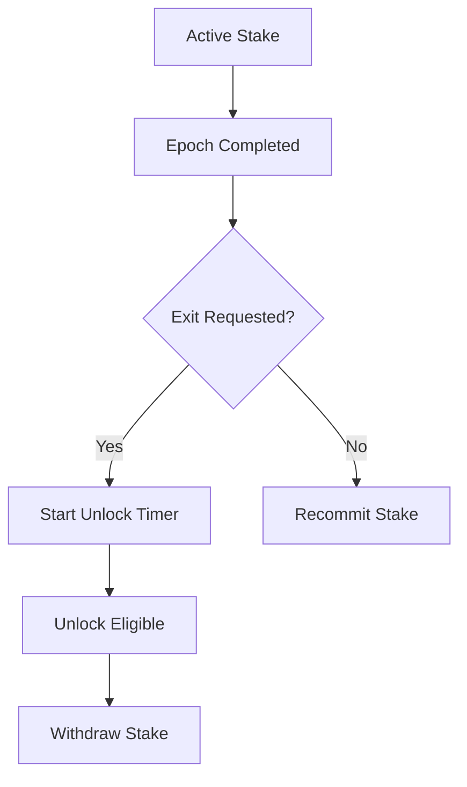

# stake_freeze_unlock_rules.md 

## Module: Stake Freeze & Unlock Rules
- **Layer**: Validator Staking & Reward System — AST (Aros Studio Tokenomics)
- **Status**: Production-grade
- **Author**: Aros Studio Blockchain Division
- **Last Updated**: 2025-07-05

---

## Overview

This module defines the lifecycle of validator stake once locked in the network. It covers freezing mechanics, unlocking procedures, withdrawal rules, and event-driven state changes. Staked funds are treated as locked collateral — bound to validator duties and performance — and cannot be freely moved unless specific criteria are met.

---

## Stake Lock Lifecycle

| Stage               | Description |
|---------------------|-------------|
| `Pending`           | Stake submitted but not yet bound to an epoch |
| `Active`            | Stake linked to a validator’s epoch commitment |
| `Frozen`            | Temporarily locked due to violation or investigation |
| `Unlocked`          | Eligible for withdrawal after exit conditions met |
| `Slashed`           | Stake partially or fully burned for violation |

---

## Unlock Conditions

| Condition                      | Outcome |
|--------------------------------|---------|
| Epoch commitment completed     | Stake moves from `Active` → `Unlocked` |
| Voluntary exit request         | Initiates delay timer (1 epoch min) |
| Governance-approved withdrawal | Immediate unlock, bypasses delay |
| Performance drop < threshold   | Triggers `Frozen` state until reviewed |

---

## Freeze Triggers

- Attestation failure (3× in one epoch)
- Node goes offline > 60 minutes during active epoch
- Stake tampering or unauthorized smart contract access
- Governance audit signal
- Technical anomaly detection via NodeChain AI

---

## Freeze Consequences

| Type         | Effect |
|--------------|--------|
| Soft Freeze  | Rewards suspended, stake remains locked |
| Hard Freeze  | Stake frozen + validator removed from active list |
| Investigative Freeze | Pending decision by governance vote |

---

## Unlock Flow
```

---



## Stake Exit Request

```json
{
  "validator": "0xA4398...",
  "epoch_end": 2914,
  "unlock_requested": true,
  "unlock_timestamp": 1720398800,
  "status": "pending_unlock"
}

```

---

## Governance Hooks

- Manual override possible via `/governance/stake/forceUnlock`
- Slashed stake enters audit ledger via `tx_audit_log_format`
- Frozen stake can be restored via vote (`unfreezeStake(address)`)

---

## Smart Contract Functions

| Function | Purpose |
| --- | --- |
| `freezeStake(address)` | Temporarily lock validator’s stake |
| `unlockStake(address)` | Move stake to withdrawal-ready status |
| `withdrawStake(address)` | Finalize removal of unlocked stake |
| `slashStake(address)` | Burn portion or full stake |
| `getStakeState(address)` | Return current stake lifecycle stage |

---

## Dependencies

- `staking_overview.md`
- `validator_registration.md`
- `validator_epoch_commitments.md`
- `staking_governance_interface.md`

---

## Next

→ See [`validator_epoch_commitments.md`](https://www.notion.so/aros-studio/validator_epoch_commitments.md) to understand how stake is assigned and bound to specific validation periods.
