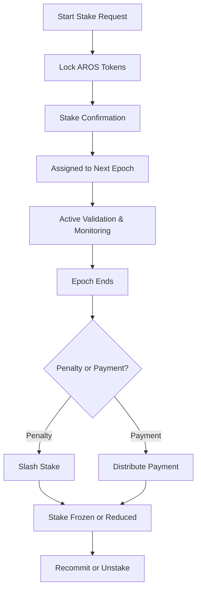

# staking_overview.md

## Module: Node Security Deposit Overview

- **Layer**: Validator Security Deposit & Payment System — AST (Aros Studio Tokenomics)
- **Status**: Production-grade
- **Author**: Aros Studio NodeChain Division
- **Last Updated**: 2025-07-05

---

## Purpose

This document provides a high-level overview of the **Node Security Deposit** mechanism in the AST network. It defines the goals, structure, actors, and lifecycle of validator deposits within the Proof of Transaction (PoT)-driven architecture.

Node Security Deposit in AST is not only an economic commitment but a governance and security requirement. All validator rights and payments are conditional on active deposit lock-in and performance adherence.

---

## Key Principles

- **PoT Activity + Security Deposit**: Only nodes with an active deposit are eligible to validate transactions and participate in PoT attestation.
- **Epoch-Based Lifecycle**: Deposit commitment is tied to epoch duration; early withdrawal is not permitted.
- **Forfeiture Enforcement**: Misbehavior or inactivity results in deposit reduction or full forfeiture.
- **Payment Binding**: Emission payments are distributed to compliant validators based on **Work Performed (Proof of Transaction)**, requiring active deposit as a bond.

---

## Node Deposit Roles

| Role              | Description |
|-------------------|-------------|
| `Validator`        | Node that locks deposit and validates transactions |
| `Delegator`        | (Optional) Entity that provides deposit capital to validator node |
| `Governance`       | Oversees deposit contracts, forfeiture, and payment policies |
| `Epoch Controller` | Coordinates epoch lifecycle and validator scheduling |

---

## Deposit Requirements

| Parameter        | Value                          |
|------------------|--------------------------------|
| Minimum Deposit  | 10,000 AROS                    |
| Lock Period      | 1 Epoch (default = 7 days)     |
| Withdrawal Delay | 1 additional epoch             |
| Forfeiture Threshold  | 3 missed attestations/epoch    |

All deposit actions are finalized on-chain and signed by the validator’s keypair. Governance can increase the minimum dynamically based on network conditions.

---

## Deposit Lifecycle

---

## Performance-Linked Mechanism

Stake is not static: validator performance is continuously monitored via:

- TX confirmation latency
- Attestation accuracy
- Fraud flag rate
- Participation ratio

Performance score directly impacts both payment multiplier and slashing sensitivity.

---

## Smart Contract Interface (Summary)

| Function | Description |
| --- | --- |
| `deposit(address, amount)` | Lock tokens for validator |
| `withdraw()` | Request withdrawal after epoch ends |
| `forfeit(address)` | Forfeit deposit of specific validator |
| `payment(address)` | Issue payment after epoch |
| `getDeposit(address)` | Query current deposit amount |

---

## Governance Hooks

- Stake thresholds adjustable via `staking_governance_interface.md`
- Emergency freeze or override callable by governance quorum
- Epoch performance snapshots reviewed every cycle

---

## Dependencies

- `validator_registration.md`
- `stake_freeze_unlock_rules.md`
- `payment_distribution_engine.md`
- `validator_performance_score.md`
- `staking_governance_interface.md`

---

## Next

→ See [`validator_registration.md`](https://www.notion.so/aros-studio/validator_registration.md) to understand how validator identities are created, verified, and enrolled.
