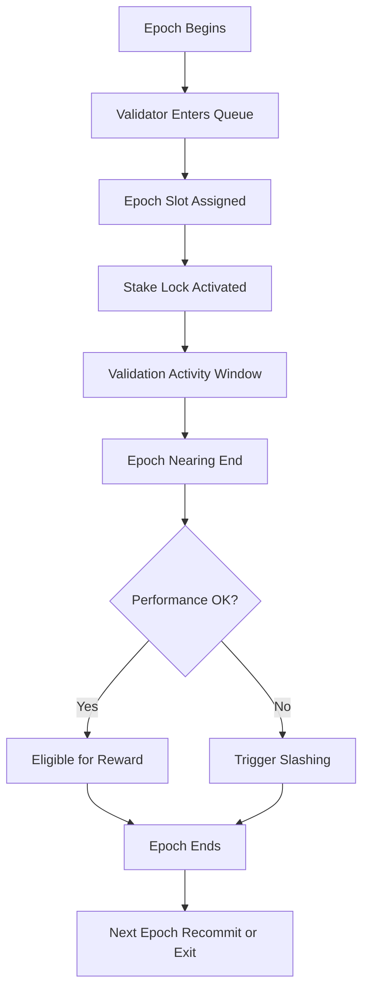

# validator_epoch_commitments.md

## Module: Validator Epoch Commitments
- **Layer**: Validator Staking & Reward System — AST (Aros Studio Tokenomics)
- **Status**: Production-grade
- **Author**: Aros Studio Blockchain Division
- **Last Updated**: 2025-07-05

---

## Overview

This document defines the rules and lifecycle for epoch-level validator commitments. Validators in the AST network must commit their stake and performance to fixed-duration validation epochs. Each epoch operates as a checkpoint for eligibility, performance assessment, and reward allocation.

Epoch commitments are strictly binding once confirmed and are managed through the Epoch Scheduler component of AST.

---

## Epoch Structure

| Parameter        | Value                     |
|------------------|---------------------------|
| Epoch Duration   | 7 days (default)          |
| Epoch ID Format  | `uint64` sequence         |
| Max Validators   | 512 per epoch             |
| Min Stake        | 10,000 AROS               |
| Finality Window  | Last 24h of epoch         |

---

## Commitment Lifecycle



---


## Key Commitment Rules

- Validators must confirm entry at least 12 hours before the epoch start
- Missed entry window results in stake being deferred to the next available epoch
- Exit requests must be filed at least 24 hours before epoch end
- Early withdrawals are forbidden unless triggered by governance override

---

## Epoch State Flags

| Flag | Meaning |
| --- | --- |
| `scheduled` | Validator has reserved slot for upcoming epoch |
| `active` | Validator is currently attesting |
| `completed` | Epoch ended, results pending processing |
| `penalized` | Violations detected during commitment |
| `exited` | Validator opted out or was removed |

---

## Performance Binding

During each epoch, validator behavior is evaluated continuously. Performance metrics include:

- Attestation correctness
- Latency under peak load
- Downtime (threshold: max 5%)
- Discrepancy signals from NodeChain observers

Failure to meet these standards results in:

- Reward reduction
- Potential freeze or slashing
- Eligibility suspension for upcoming epochs

---

## Governance Control Points

- Epoch duration can be adjusted via governance vote
- Emergency ejection of validator during epoch (with audit trail)
- Epoch state history recorded and published per cycle
- Batch override possible via `EpochOverridePackage`

---

## Smart Contract Functions

| Function | Description |
| --- | --- |
| `assignValidatorToEpoch()` | Assign validator to next available slot |
| `confirmEpochEntry()` | Lock in stake for upcoming epoch |
| `requestEpochExit()` | Mark validator for removal after current epoch |
| `getEpochState(vid)` | Retrieve validator epoch status |

---

## Dependencies

- `staking_overview.md`
- `validator_registration.md`
- `stake_freeze_unlock_rules.md`
- `reward_distribution_engine.md`
- `validator_performance_score.md`

---

## Next

→ See [`reward_distribution_engine.md`](https://www.notion.so/validator_rewards/reward_distribution_engine.md) to understand how rewards are calculated and issued at the end of each epoch.

```

```
