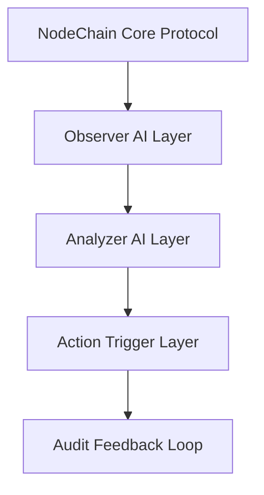

# agent_architecture.md

## Module: NodeChain AI Agents – Architecture Overview
- **Layer**: NodeChain Core – AST (Aros Studio Tokenomics)
- **Status**: Production-grade
- **Author**: Aros Studio Blockchain Division
- **Last Updated**: 2025-07-05

---

## Purpose

Define the layered structure, lifecycle, communication protocols, and deployment strategy of AI Agents operating in the NodeChain environment. These agents are autonomous, decentralized, and modular by design — each with a clearly scoped responsibility within transaction analysis, validator monitoring, fraud detection, and audit logging.

---

## Core Principles

- **Layered Autonomy** — Each AI agent functions independently but adheres to NodeChain’s global communication and consensus rules.
- **Deterministic Memory Footprint** — No agent may exceed its assigned memory/time bounds.
- **Immutable Anchoring** — All agent outputs are permanently logged and hash-anchored.
- **Dispute-Tolerant Architecture** — Conflicting outputs between agents trigger arbitration workflows.

---

## Layered Architecture



| Layer | Description |
| --- | --- |
| `Observer Layer` | Continuously monitors transaction streams and validator activity |
| `Analyzer Layer` | Performs behavioral analysis, fraud probability scoring, and consensus anomaly detection |
| `Trigger Layer` | Initiates slashing, reward suspension, escalation, or rollback based on AI decisions |
| `Feedback Loop` | Feeds analysis results back into NodeChain’s training set for meta-learning and performance tuning |

---

## Agent Lifecycle

| Stage | Description |
| --- | --- |
| `Initialize()` | Load weights, protocols, and config from global NodeChain registry |
| `Observe()` | Receive stream of signed transaction + validator metadata |
| `Analyze()` | Run model on input data, score behavior, detect anomalies |
| `Act()` | If threshold breached, trigger protocol-bound action |
| `Log()` | Hash output, commit to audit chain |
| `Feedback()` | Submit learning metrics to meta-learning interface |

---

## Communication Protocol

- All agents communicate via encrypted gRPC streams
- Each agent assigned unique identifier (Agent-ID) and certificate
- Critical actions require multisignature agent consensus (`≥ 3 of 5 agents`)
- Communication logs are anchored in `audit_trace_emitter.md`

---

## Sandbox Containment

- Each agent runs in isolated WASM sandbox
- Forbidden: arbitrary external HTTP requests, local file writes, state leakage
- Memory quota: max 512MB per agent
- Execution time: max 350ms per decision loop

---

## Output Anchoring

Each agent output includes:

- Agent ID
- Timestamp
- Decision hash
- Signed assertion blob
- Reference to affected block/epoch

Example:

```json
{
  "agent_id": "OBS-AI-1093",
  "epoch": 2289,
  "action": "flag_validator",
  "vid": "V-8842",
  "reason": "Pattern match: fraudulent_tx_burst",
  "decision_hash": "0x2ab4ff...",
  "signed_blob": "-----BEGIN ASSERTION----- ...",
  "timestamp": 1720941010
}

```

---

## Dependencies

- `validator_behavior_monitor.md`
- `tx_pattern_recognition.md`
- `fraud_signal_dispatcher.md`
- `audit_trace_emitter.md`

---

## Next

→ Continue with [`agent_roles_matrix.md`](https://www.notion.so/aros-studio/agent_roles_matrix.md) for a complete list of AI agents and their designated roles.

```

```
