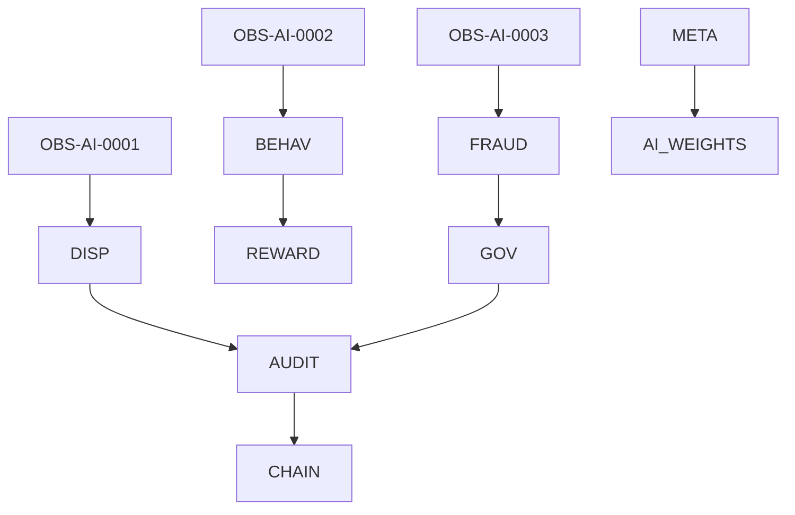

# agent_roles_matrix.md (1)

---

```markdown
# 📄 agent_roles_matrix.md

## Module: Agent Roles Matrix
**Layer**: NodeChain AI Agents – AST (Aros Studio Tokenomics)
**Status**: Production-grade
**Author**: Aros Studio Blockchain Division
**Last Updated**: 2025-07-05

---

## Purpose

Provide a complete, detailed, and operational mapping of all AI Agents within the NodeChain AI subsystem. This matrix serves as a control surface for architectural validation, auditing chain-of-responsibility, and defining escalation paths during dispute resolution or fraud detection.

---

## Layered AI Agent Roles

| Agent ID         | Role Description                        | Input Data                            | Output Action                        | Escalation Target             |
|------------------|------------------------------------------|----------------------------------------|--------------------------------------|-------------------------------|
| `OBS-AI-0001`    | Transaction Volume Observer              | Live TX stream                         | TX count anomaly flag                | `DISP-AI-0013`                |
| `OBS-AI-0002`    | Validator Activity Observer              | Validator heartbeat                    | Offline alert                        | `BEHAV-AI-0031`               |
| `OBS-AI-0003`    | TX Fee Pattern Observer                  | TX fee metadata                        | Irregular fee flag                   | `FRAUD-AI-0078`               |
| `BEHAV-AI-0031`  | Behavior Pattern Analyzer                | Validator attestation logs             | Score adjustment signal              | `REWARD-CORE`                 |
| `FRAUD-AI-0078`  | Fraud Signature Detector                 | TX metadata + signature bundle         | Trigger `slashStake()`               | `GOV-AI-0049`                 |
| `DISP-AI-0013`   | Dispute Resolver                         | Conflicting flags or agent disagreement| Resolution arbitration report        | `AUDIT-EMIT-0009`             |
| `AUDIT-EMIT-0009`| Audit Hash Generator                     | Any confirmed action from agents       | Immutable log entry + anchor hash    | `CHAIN-ANCHOR`                |
| `GOV-AI-0049`    | Governance Escalation Handler            | Critical slashing / override flag      | Governance vote trigger              | `MULTISIG-GOV-LAYER`         |
| `META-AI-0088`   | Meta-learning Loop Coordinator           | Agent outcome stats                    | Parameter tuning feedback            | `AI-WEIGHTS-REGISTRY`         |

---

## Agent Chain of Command Diagram



---


## Role Breakdown

### 🔍 `OBS-AI-*`: Observers

- Stateless stream processors
- Detect irregularities without judgment
- Escalation based on statistical deviation

### 🧠 `BEHAV-AI-*`: Behavioral Analyzers

- Interpret validator reliability, consistency, and responsiveness
- Adjust internal trust scores
- Feed impact into reward engine

### ⚠️ `FRAUD-AI-*`: Fraud Classifiers

- Detect malformed signatures, key misusage, impersonation
- Trigger slashing via `slashStake()` with cryptographic justification

### 🤝 `DISP-AI-*`: Dispute Arbitration

- Receives conflicting signals
- Initiates arbitration protocol
- Provides final resolution record for anchoring

### 🪪 `GOV-AI-*`: Governance Handlers

- Manage overrides, urgent validator changes, dispute escalation
- Link to formal governance layer with vote mechanism

### 📡 `AUDIT-EMIT-*`: Anchor Loggers

- Hash output of all escalated/triggered actions
- Commit result to immutable audit ledger

### 🔁 `META-AI-*`: Meta-Learning Agents

- Observe outcomes across epochs
- Adjust internal thresholds and weights
- Improve model adaptivity over time

---

## Example Use Cases

| Scenario | Involved Agents | Result |
| --- | --- | --- |
| Validator goes offline unexpectedly | `OBS-AI-0002` → `BEHAV-AI-0031` | Score dropped; REWARD-CORE notified |
| TX surge with high fees | `OBS-AI-0001`, `OBS-AI-0003` → `FRAUD-AI` | Flag issued; potential `slashStake()` initiated |
| Two agents produce conflicting flags | `DISP-AI-0013` | Arbitration started; conflict resolved |
| Critical override required (emergency) | `FRAUD-AI` → `GOV-AI` | Governance vote triggered via `/proposal` |

---

## Escalation Flow Rules

- No agent can finalize chain-impacting action solo (min 2-signature consensus)
- Critical actions (slashing, override) require at least 3-of-5 AI votes
- Audit anchor is mandatory for every escalated action
- Governance handlers may pause or freeze action pipelines during override windows

---

## Logging Format

Each agent logs structured output:

```json
{
  "agent_id": "FRAUD-AI-0078",
  "action": "slashStake",
  "vid": "V-8822",
  "reason": "malicious signature cluster",
  "hash": "0xabc9123...",
  "timestamp": 1720941938
}

```

---

## Dependencies

- `agent_architecture.md`
- `validator_behavior_monitor.md`
- `audit_trace_emitter.md`
- `fraud_signal_dispatcher.md`
- `consensus_dispute_resolver.md`
- `staking_governance_interface.md`

---

## Next

→ Proceed to [`validator_behavior_monitor.md`](https://www.notion.so/aros-studio/validator_behavior_monitor.md) to explore behavioral analysis logic in detail.

```

---

Если одобряешь — идём дальше: `validator_behavior_monitor.md`.
```