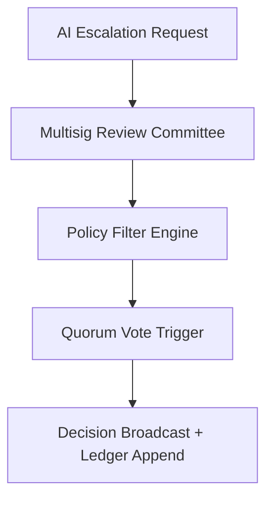

# ai_governance_escalation.md 

## Module: Governance Escalation
- **Layer**: NodeChain AI Agents – AST (Aros Studio Tokenomics)
- **Status**: Production-grade
- **Author**: Aros Studio NodeChain Division
- **Last Updated**: 2025-07-05

---

## Purpose

Establish the formal process for escalating critical decisions from AI agents (e.g., fraud detections, validator penalties, dispute outcomes) to a human-in-the-loop governance structure, where multisig quorum, policy filters, and override conditions may intervene in automated actions.

---

## Trigger Conditions

| Trigger ID | Description |
|------------|-------------|
| G-01       | High-severity fraud with irreversible impact |
| G-02       | Validator slashing involving Tier-0 or anchor validators |
| G-03       | Disputes unresolved within time threshold |
| G-04       | Meta-learning overrides rejected twice |
| G-05       | Community-submitted governance proposals |

---

## Escalation Path



---

## Committee Composition

- Minimum 5 human members (GOV-QUORUM-5)
- Bound by AI-reviewed conflict of interest policies
- Members sign via hardware-secured wallets

---

## Policy Filter Engine

| Filter | Function |
| --- | --- |
| `ConfIntCheck` | Verifies if committee members are unbiased |
| `ImpactAssessment` | Simulates long-term impact of decision |
| `CommunityPulse` | Checks external signals (e.g. validator forums) |
| `AI Override Review` | Crosschecks with META-AI recommendation trail |

---

## Decision Encoding

```json
{
  "governance_event_id": "GOV-84411",
  "origin": "DISP-AI-0021",
  "action": "validator suspension override rejected",
  "committee_signature": [
    "sig1", "sig2", "sig3", "sig4", "sig5"
  ],
  "quorum_result": "deny",
  "timestamp": 1720945834
}

```

---

## Transparency & Access

- All escalated cases are anchored into `AUDIT-EMIT`
- Sanitized version of governance ledger is available to external watchdogs
- In exceptional circumstances, encrypted annexes can be attached for internal-only review

---

## Dependencies

- `fraud_signal_dispatcher.md`
- `consensus_dispute_resolver.md`
- `meta_learning_feedback_loop.md`
- `audit_trace_emitter.md`
- `validator_governance_flags.md`

---
```

```
