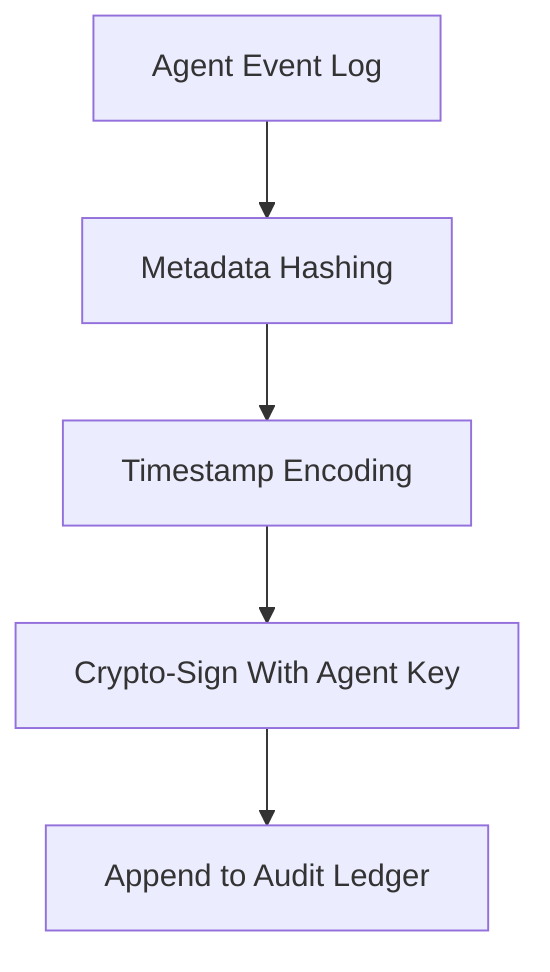

# audit_trace_emitter.md

## Module: Audit Trace Emitter
- **Layer**: NodeChain AI Agents – AST (Aros Studio Tokenomics)
- **Status**: Production-grade
- **Author**: Aros Studio NodeChain Division
- **Last Updated**: 2025-07-05

---

## Purpose

Define the module responsible for committing critical agent decisions, dispute outcomes, fraud signal dispatches, and escalation events into a cryptographically signed and immutable audit trail for later review, governance arbitration, and public transparency.

---

## Data Sources

The emitter captures and signs:

- All decisions from `consensus_dispute_resolver`
- Signals routed through `fraud_signal_dispatcher`
- Arbitration summaries
- Validator flagging events
- Meta-adaptive threshold changes
- Governance escalations and overrides

---

## Commitment Pipeline



---

## Ledger Format

Each audit log entry is stored in a Merkle-indexed ledger block with:

- Unique `event_id`
- Origin module and agent
- Cryptographic signature
- Timestamp
- Context payload
- Integrity hash of previous log

---

## Sample Output

```json
{
  "event_id": "AUD-395221",
  "origin": "FRAUD-AI-0078",
  "action": "slashStake()",
  "entity": "V-1390",
  "timestamp": 1720945494,
  "signature": "0xklsf3c9a...",
  "prev_hash": "0x9fe2e44...",
  "context": {
    "trigger": "Critical anomaly + pattern P-311",
    "risk_score": 0.96
  }
}

```

---

## Integrity Mechanisms

- Each entry is cryptographically linked to the previous
- Root hash recalculated and written per epoch
- External verifiers (watchdog nodes) can validate hashes

---

## Governance Readout

- `GOV-AI` and `META-AI` agents have read-access to full audit trails
- Manual override events require dual signatures from human multisig quorum
- External observers may access sanitized audit ledgers via the public interface

---

## Dependencies

- `fraud_signal_dispatcher.md`
- `consensus_dispute_resolver.md`
- `meta_learning_feedback_loop.md`
- `slash_and_suspend_interface.md`
- `governance_escalation.md`

---

## Next

→ Proceed to [`meta_learning_feedback_loop.md`](https://www.notion.so/aros-studio/meta_learning_feedback_loop.md) to understand how AI thresholds, weights, and escalation triggers evolve based on historic outcomes.

```

```
