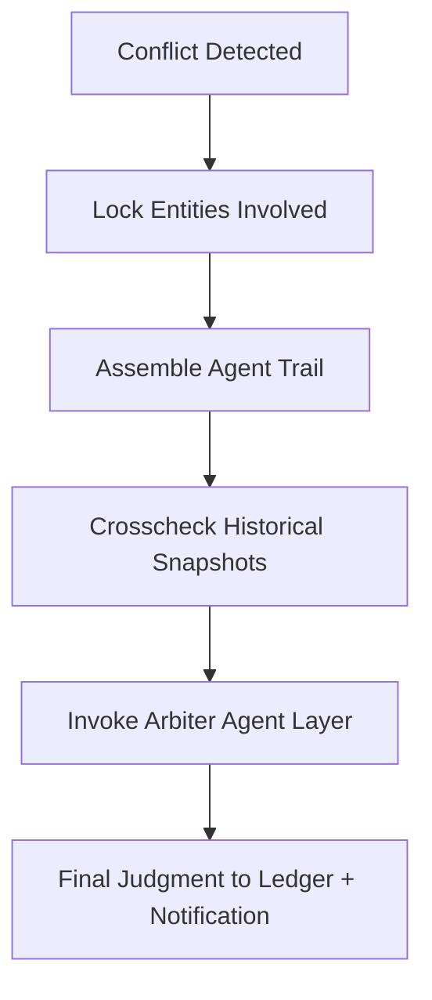

# consensus_dispute_resolver.md

## Module: Consensus Dispute Resolver
- **Layer**: NodeChain AI Agents – AST (Aros Studio Tokenomics)
- **Status**: Production-grade
- **Author**: Aros Studio Blockchain Division
- **Last Updated**: 2025-07-05

---

## Purpose

Define the arbitration and resolution mechanisms used when two or more AI agents emit conflicting decisions or when consensus among validator clusters is unclear due to deviation, interference, or temporal inconsistency.

This module provides deterministic conflict resolution, preserving chain continuity and restoring validator or agent trust logic when ambiguity arises.

---

## Conflict Triggers

A dispute may be triggered under the following conditions:

| Condition                            | Description |
|-------------------------------------|-------------|
| Conflicting fraud signals           | Two agents flag same TX with opposite assessments |
| Split validator votes               | Validator cluster vote is non-deterministic or exceeds divergence threshold |
| Agent time-window drift             | Agent outputs fall outside coordinated clock |
| Shard interlock conflict            | Two shards assign incompatible block orderings |
| Manual override dispute             | Governance manually intervenes, triggering dispute trail |

---

## Arbitration Flow



---

## Arbiter Layer Composition

| Component | Function |
| --- | --- |
| `ARB-CLOCK-SYNC` | Verifies timing consistency of agent emissions |
| `ARB-TX-HISTORY` | Compares flagged TX against prior TX trails |
| `ARB-AGENT-REPUTE` | Applies historical performance of agents as weighting |
| `ARB-VOTE-TALLY` | Reruns validator voting trace if needed |

---

## Output Format

```json
{
  "dispute_id": "DSP-228",
  "trigger": "Split Fraud Signals",
  "entities_locked": ["TX-0xabc291", "V-9822"],
  "arbiter_ruling": "Fraud Confirmed",
  "dominant_source": "ADE-AI-0174",
  "confidence": 0.91,
  "final_action": "R-01 → slashStake()",
  "timestamp": 1720945241
}

```

---

## Time Constraints

- Arbitration must resolve within `Δ < 12s`
- If unresolved: escalate to `GOV-AI`
- Final decision is logged immutably in `AUDIT-EMIT` with arbitration trail

---

## Agent Priority Model

| Priority Rank | Agent Type |
| --- | --- |
| 1 | Arbiter Composite |
| 2 | Meta Feedback AI |
| 3 | Core Fraud Engine |
| 4 | Pattern Detectors |
| 5 | Observers |

---

## Dependencies

- `fraud_signal_dispatcher.md`
- `audit_trace_emitter.md`
- `meta_learning_feedback_loop.md`
- `ai_governance_escalation.md`
- `validator_behavior_monitor.md`

---

## Next

→ Proceed to [`audit_trace_emitter.md`](https://www.notion.so/aros-studio/audit_trace_emitter.md) to see how final outcomes are immutably committed to the audit layer and available for public review or internal traceability.

```

```
