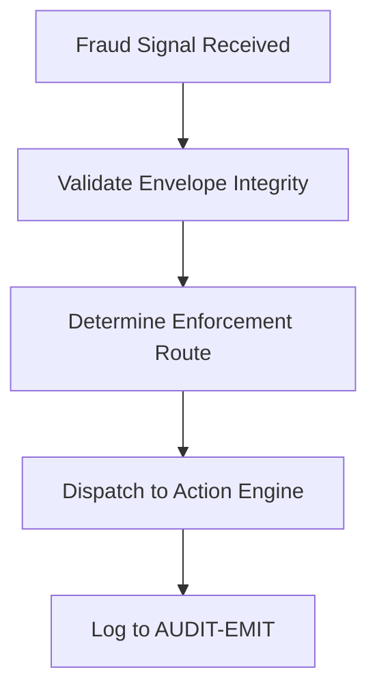

# fraud_signal_dispatcher.md (1)

---

```markdown
# 📄 fraud_signal_dispatcher.md

## Module: Fraud Signal Dispatcher
**Layer**: NodeChain AI Agents – AST (Aros Studio Tokenomics)
**Status**: Production-grade
**Author**: Aros Studio Blockchain Division
**Last Updated**: 2025-07-05

---

## Purpose

This module defines the mechanisms by which validated fraud signals, generated by upstream anomaly detection or pattern recognition agents, are dispatched to actionable enforcement points (e.g., slashing engine, governance override, audit anchor), with full traceability and role separation.

---

## Signal Ingress Sources

The dispatcher receives fraud signals from:

- `ADE-AI` (Anomaly Detection Engine)
- `TXPAT-AI` (Transaction Pattern Agents)
- `BEHAV-AI` (Validator Behavior Analyzers)
- Direct dispute resolution outcomes (`DISP-AI`)
- Manual governance triggers (`GOV-AI` override paths)

Each signal is validated for structural integrity, timestamp signature, and agent provenance.

---

## Processing Flow



---

## Enforcement Routes

| Route ID | Description | Target Engine |
| --- | --- | --- |
| `R-01` | Stake Slashing | `slashStake()` API |
| `R-02` | Temporary Validator Suspension | `validatorFreeze()` |
| `R-03` | Flag and Report Only | `AUDIT-EMIT` only |
| `R-04` | Multi-Agent Crosscheck Required | `DISP-AI` arbitration |
| `R-05` | Governance Override Proposal | `GOV-AI` escalation |

---

## Sample Signal Format

```json
{
  "signal_id": "FRAUD-S-9931",
  "source_agent": "TXPAT-AI-0493",
  "pattern_id": "P-311",
  "risk_score": 0.96,
  "recommended_route": "R-01",
  "target_vid": "V-2011",
  "tx_reference": "0xdec8821f",
  "timestamp": 1720944992
}

```

---

## Validation Steps

1. Verify source signature
2. Match signal hash with registered anomaly hash in logbook
3. Confirm timestamp is within ±2 seconds of network clock
4. If failed, reroute to `DISP-AI` for arbitration

---

## Logging & Anchoring

Every dispatched signal triggers the following:

- Emission of audit log via `AUDIT-EMIT-0009`
- Update to `fraud_signal_ledger` with indexable reference
- Inclusion in agent accountability journal

---

## Escalation Logic

| Condition | Escalation Target |
| --- | --- |
| Conflicting signals | `DISP-AI` |
| Critical pattern + validator tier 1 | `GOV-AI` |
| Failed validation step | `DISP-AI`, `AUDIT` |
| Governance freeze window active | `MULTISIG-GOV-LAYER` |

---

## Dependencies

- `anomaly_detection_engine.md`
- `tx_pattern_recognition.md`
- `audit_trace_emitter.md`
- `ai_governance_escalation.md`
- `slash_and_suspend_interface.md`

---

## Next

→ Proceed to [`consensus_dispute_resolver.md`](https://www.notion.so/aros-studio/consensus_dispute_resolver.md) for arbitration mechanics during agent conflicts or ambiguous fraud signals.

```

```