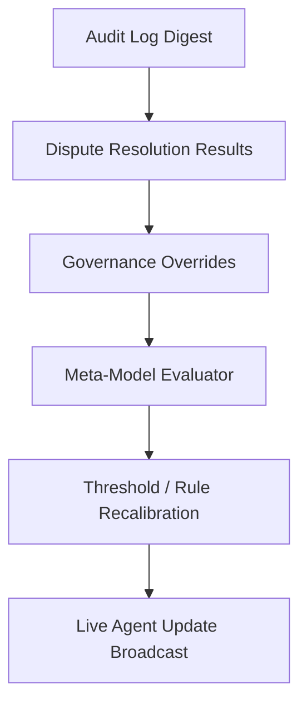

# meta_learning_feedback_loop.md (1)

---

```markdown
# 📄 meta_learning_feedback_loop.md

## Module: Meta-Learning Feedback Loop
**Layer**: NodeChain AI Agents – AST (Aros Studio Tokenomics)
**Status**: Production-grade
**Author**: Aros Studio Blockchain Division
**Last Updated**: 2025-07-05

---

## Purpose

This module defines the AI-driven feedback mechanism that continuously evaluates the accuracy, precision, false positives/negatives, and long-term impact of previous agent decisions (fraud signals, slashing actions, governance escalations) in order to optimize future thresholds, weights, and behavior rules.

---

## Core Principles

- **Outcome-Aware AI Adaptation**: Adjust AI sensitivity based on real-world dispute outcomes.
- **Historical Back-Propagation**: Re-assess historical decisions with updated models for accuracy drift.
- **Governance-Tuned Bias Correction**: Apply policy-guided bias overrides (e.g., over-penalization of new validators).

---

## Feedback Collection Pipeline



---

## Feedback Vectors

| Input Type | Examples |
| --- | --- |
| Audit Outcomes | Slashing reversed by dispute ruling |
| False Positive Reports | Validator later cleared of fault |
| False Negative Detection | Undetected fraud exposed post-factum |
| Pattern Accuracy Drift | Pattern detection loses precision |
| Escalation Inefficiency | Excessive GOV-AI routing w/o action |

---

## Sample Feedback Report

```json
{
  "cycle": "epoch_2299",
  "input_source": "AUDIT-EMIT",
  "recalibrated_agents": [
    {
      "agent": "ADE-AI-0174",
      "updated_threshold": 0.76,
      "confidence_curve": "flattened"
    },
    {
      "agent": "TXPAT-AI-0493",
      "false_positive_penalty": 0.12
    }
  ],
  "timestamp": 1720945683
}

```

---

## Update Mechanism

- All updated thresholds are signed by `META-AI` and versioned
- Changes are published to agent orchestration layer every epoch
- Manual overrides by governance quorum are flagged and reviewed

---

## Safeguards

- No real-time retroactive revocation is allowed
- Feedback is *forward-applied only*
- Agents under recalibration are flagged in `AGENT-LEDGER` as "Pending Feedback Sync"

---

## Dependencies

- `audit_trace_emitter.md`
- `governance_escalation.md`
- `agent_roles_matrix.md`
- `ai_training_baseline.md`
- `tx_pattern_recognition.md`

---

## Next

→ Proceed to [`governance_escalation.md`](https://www.notion.so/aros-studio/governance_escalation.md) to understand how AI decisions are escalated, overridden, or ratified by human-led governance structures.

```

```