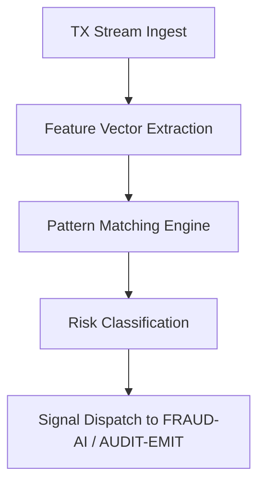

# tx_pattern_recognition.md

## Module: Transaction Pattern Recognition
- **Layer**: NodeChain AI Agents – AST (Aros Studio Tokenomics)
- **Status**: Production-grade
- **Author**: Aros Studio Blockchain Division
- **Last Updated**: 2025-07-05


---

## Purpose

This module describes the AI agent logic used for recognizing and classifying transaction behavior across the network, with the goal of early detection of anomalous, repetitive, malicious, or algorithmically generated transaction flows.

---

## Input Sources

The agent subscribes to a real-time event stream consisting of:

- Full transaction metadata (TX ID, sender, recipient, amount, fee, timestamp)
- Validator node metadata (if available)
- Shard and block context
- Signature metadata (method, curve, entropy score)

---

## Feature Extraction

The agent computes a feature vector for each transaction stream, including:

| Feature                       | Description |
|-------------------------------|-------------|
| `TX Frequency`                | Rolling window frequency of transactions per address |
| `Destination Entropy`         | Shannon entropy of recipient addresses |
| `TX Fee Variation Index`      | Standard deviation of fees within a session |
| `Time Gap Consistency`        | Variability of intervals between TXs |
| `Looping Pattern Score`       | Detection of sender-receiver loops over time |
| `Synthetic Signature Score`   | Probability that signature was AI- or bot-generated |
| `Sharded Dispersion Index`    | Distribution pattern across shards |

---

## Pattern Types

| Pattern ID     | Label                       | Risk Level | Description |
|----------------|-----------------------------|------------|-------------|
| `P-101`        | TX Flood (Burst)            | Medium     | Sudden high-frequency surge of transactions |
| `P-204`        | Shard Overload              | High       | Disproportionate targeting of a shard |
| `P-311`        | Synthetic Transaction Chain | Critical   | Patterned TXs with bot-like signatures |
| `P-409`        | Fee Spike Injection         | Medium     | Artificially inflated TX fees |
| `P-510`        | Circular Loop               | High       | Recurrent sender-recipient TX loops |

---

## Detection Workflow



---

## Output Format

```json
{
  "agent_id": "TXPAT-AI-0493",
  "tx_id": "0xabcdd992",
  "pattern_id": "P-311",
  "label": "Synthetic Transaction Chain",
  "risk_level": "Critical",
  "confidence": 0.94,
  "shard_id": "S-09",
  "block_height": 1198332,
  "timestamp": 1720943955
}

```

---

## Escalation Paths

| Risk Level | Forwarded To | Action Trigger |
| --- | --- | --- |
| Medium | `FRAUD-AI` | Monitoring + delayed escalation |
| High | `FRAUD-AI`, `GOV-AI` | Immediate flag + governance notify |
| Critical | `FRAUD-AI`, `DISP-AI` | Flag + arbitration + audit emission |

---

## Anchoring

- All flagged pattern events are signed and logged in `audit_trace_emitter.md`
- High/Critical risk TXs are tagged permanently in the transaction ledger

---

## Dependencies

- `fraud_signal_dispatcher.md`
- `anomaly_detection_engine.md`
- `audit_trace_emitter.md`
- `agent_roles_matrix.md`

---

## Next

→ Proceed to [`anomaly_detection_engine.md`](https://www.notion.so/aros-studio/anomaly_detection_engine.md) to understand low-level anomaly scoring models and signal weighting.

```

```
