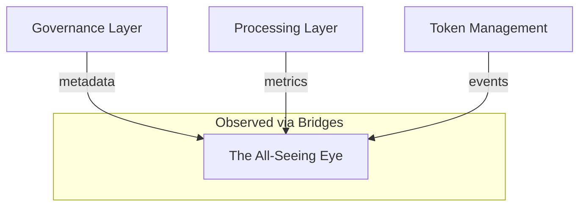

# observation_scope_and_limits.md

## 1. Purpose

This document defines the **precise boundaries** of what **The All-Seeing Eye** can observe within the AST architecture, and what is explicitly **excluded** from its scope. This ensures clarity, prevents scope creep, and reinforces the Eye’s non-intrusive design.

---

## 2. Observation Scope — Allowed Domains

The Eye is granted **read-only access** to selected metadata layers. It does **not access raw logic**, private storage, or execution-level internals.

| Layer                 | Observable Elements                                      |
|-----------------------|----------------------------------------------------------|
| Governance Layer      | Proposal metadata, role grants, vote timestamps         |
| Processing Layer      | Queue load metrics, execution event metadata            |
| Token Management      | Token mint/burn events, supply drift indicators         |
| Ledger Anchoring      | Merkle root updates, epoch hash checkpoints             |

Each of these is exposed through **dedicated read-only bridges** configured at deployment.

---

## 3. Observation Limits — Forbidden Domains

The Eye is **explicitly restricted** from accessing or interacting with:

- Contract internal state (e.g., mappings, memory, storage layout)
- User account details (balances, addresses, history)
- Runtime call stacks or reentrancy traces
- Keys, secrets, or authentication payloads
- Consensus protocol internals (gas state, opcodes, mempool)

Any access attempt outside the allowed scope results in a hard denial via architecture-level guards.

---

## 4. Layer-Filtered Architecture
```



- The Eye receives only **derived, signed summaries**
- No direct database access or internal contract calls
- Fully isolated from permissioned actions

---

## 5. Dynamic Expansion Control

While the observation model is fixed at deployment, future expansion may occur via **explicit governance authorization**. This requires:

- A formal proposal vote
- Justified purpose audit
- Contract-bound scope adjustment

Until such expansion is approved, the Eye operates under strict minimal visibility.

---

## 6. Summary

The All-Seeing Eye is a **limited-scope auditor**, not a universal observer.

Its mission is not omniscience — but **focused architectural traceability**.
