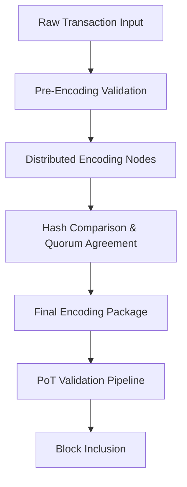

# decentralized_tx_encoding.md (1)

```markdown

# **decentralized_tx_encoding.md**  
**Module:** AST — Aros Studio Tokenomics  
**Component:** Decentralized Transaction Encoding  
**Status:** Draft  
**Author:** AROS Studio  
**Date:** 2025-08-11  

---

## **1. Purpose and Scope**  
This document defines the architecture, data structures, and operational rules for **Decentralized Transaction Encoding** (DTE) in the AST network.  
The module is responsible for transforming raw transaction input into a secure, verifiable, and consensus-compliant binary package that can be propagated across the AST NodeChain without relying on a single encoding authority.  

**Core goals:**  
- Eliminate single points of failure in transaction packaging.  
- Guarantee deterministic encoding across distributed nodes.  
- Preserve integrity and authenticity via multi-layer signatures.  
- Ensure compatibility with **Proof of Transaction (PoT)** and downstream validation pipelines.  

---

## **2. Architectural Overview**

The DTE process is executed in **three main phases**:

1. **Pre-Encoding Validation**  
   - Verify transaction completeness and adherence to AST Transaction Schema v1.3+.  
   - Check sender signature validity.  
   - Assign `tx_weight`, `tx_priority`, and PoT metadata.

2. **Distributed Encoding**  
   - A minimum quorum of encoding nodes (≥3) processes the same raw transaction.  
   - Each node independently serializes and hashes the data.  
   - Hash results are compared via consensus (≥2/3 match required).  
   - Final encoding is stored in Merkle-based structure for inclusion in the block.

3. **Finalization & Broadcast**  
   - Encoded package is signed by encoding quorum.  
   - Broadcast to validator pool for PoT confirmation.  

---

## **3. Data Flow Diagram**



---

## **4. Encoding Format**

**Base encoding**: CBOR (Concise Binary Object Representation) with deterministic field ordering.  
**Compression**: LZ4 (optional, negotiated per network settings).  
**Integrity**: SHA3-512 hash of encoded payload.  

**Example JSON before encoding:**

```json
{
  "tx_id": "d1a8b9e0c2",
  "sender": "AST1qz9y6m3plw...",
  "recipient": "AST1g8h2f9m7kq...",
  "amount": 5000,
  "asset": "AROS",
  "timestamp": "2025-08-11T12:43:00Z",
  "tx_weight": 0.85,
  "priority": "high",
  "prev_tx_ref": "a3f1c99d77...",
  "signature": "0xabc123...",
  "metadata": {
    "purpose": "settlement",
    "note": "Vendor payment"
  }
}
```

**Encoded (CBOR + SHA3-512 digest appended):**

```
BF 6A 74 78 5F 69 64 6A 64 31 61 38 62 39 65 30 63 32 ...
HASH: e3b0c44298fc1c149afbf4c8996fb924...
```

---

## **5. Consensus Encoding Protocol**

- **Minimum Encoding Nodes:** 3  
- **Consensus Threshold:** 67% hash match  
- **Replay Prevention:** Nonce + prev_tx_ref inclusion  
- **Dispute Handling:**  
  - If <67% match, transaction is returned to sender for resubmission.  
  - Nodes with >3% mismatch rate over 100 transactions enter **quarantine mode**.  

---

## **6. Security Considerations**

- **Tampering:** Multi-signature protection from encoding quorum.  
- **Encoding Malfunction:** PoT pipeline rejects any payload with mismatched hashes.  
- **Sybil Attack Resistance:** Encoding nodes require staking and PoT reputation score ≥0.8.  

---

## **7. Governance & Upgradability**

- **Schema Changes:** Managed via AST Governance Contract with 14-day review.  
- **Encoding Algorithm Upgrade:** Requires 80% validator approval.  
- **Backward Compatibility:** All encoding changes must preserve ability to decode legacy payloads for at least 24 months.

---

## **8. Testing & Benchmarking**

- **Performance Metrics:**  
  - Encoding latency ≤ 50 ms per transaction.  
  - Consensus finalization ≤ 150 ms.  
- **Test Vectors:** Stored in `tests/dte_vectors.json`.  
- **Benchmark Tools:** `bench_dte_encoder.ts` in `/tools/benchmarks`.

---

Если хочешь, я могу сразу сделать второй документ — **`dte_security_threat_models.md`** — чтобы к этому модулю была готова вся связка. Так мы закроем блок полностью и сразу, без остановок.  

Делаем?
```