# Architecture Diagrams

This document provides Mermaid diagrams for each major component of the AROS-PARADIGM AST repository and an overall system view.

## Overall System Architecture
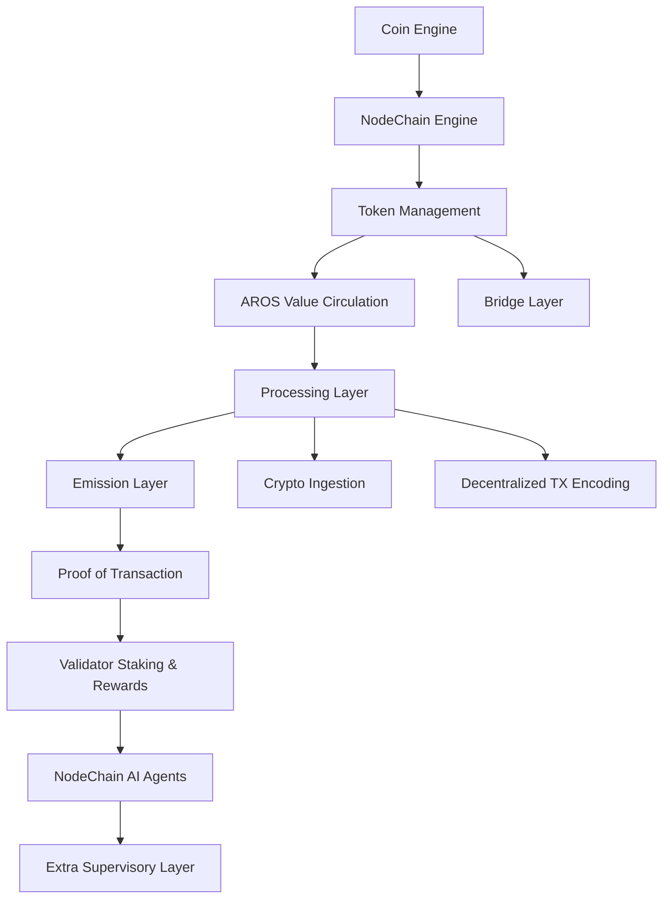

## Coin Engine
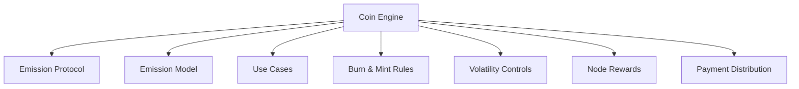

## NodeChain Engine
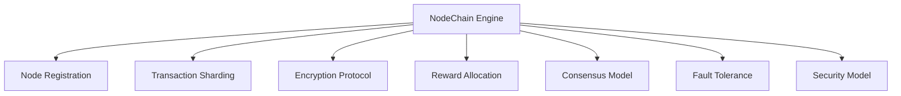

## Token Management Layer
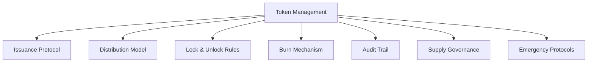

## AROS Value Circulation
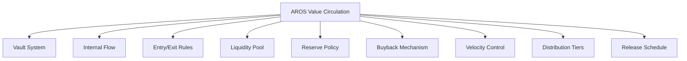

## Bridge Layer
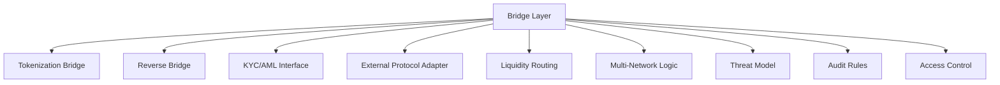

## Governance Layer
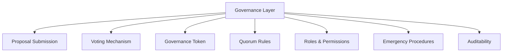

## Processing Layer
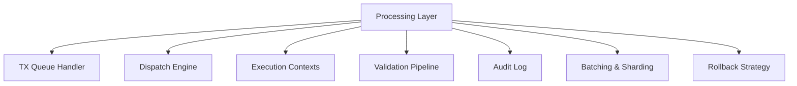

## Emission Layer
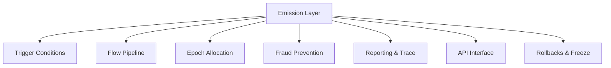

## Crypto Ingestion Pipeline
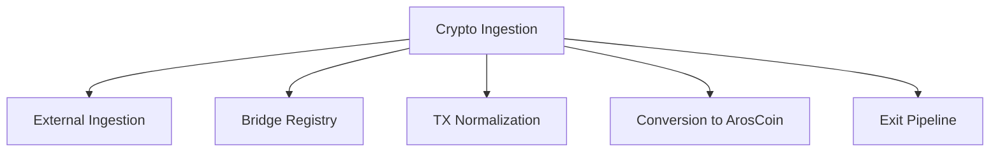

## Proof of Transaction Engine
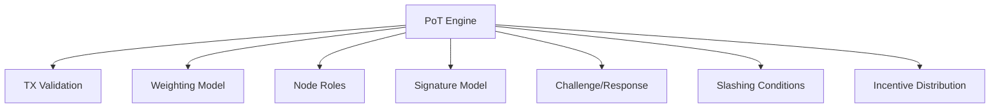

## Validator Staking & Rewards
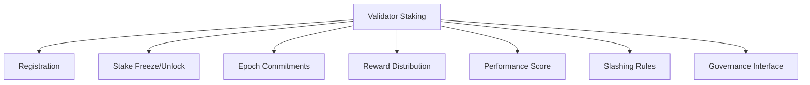

## NodeChain AI Agents
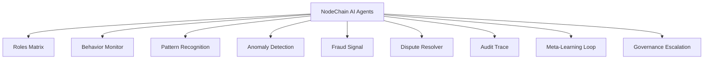

## Extra Supervisory Layer
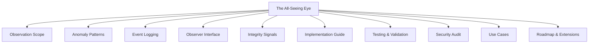

## Decentralized TX Encoding
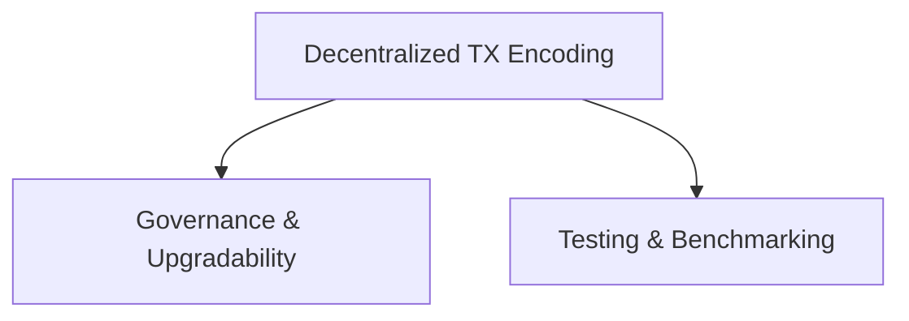

