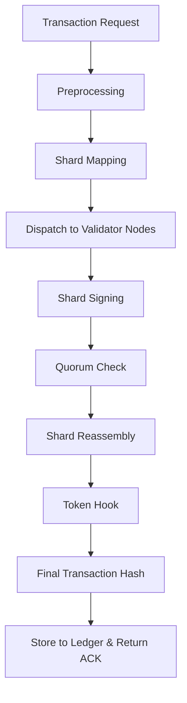

# transaction_lifecycle.md (1)

---

### **📄**

### **transaction_lifecycle.md**

```
# Transaction Lifecycle Model

## 🎯 Purpose of This Document

This document defines the complete lifecycle of a transaction within the AST system — from entry into the NodeChain engine to final storage on the Aros Ledger. It ensures clarity, traceability, and verifiability of every transformation the transaction undergoes.

---

## 🧩 Core Lifecycle Stages

1. **Request Entry**: Transaction arrives from external or internal source.
2. **Preprocessing**: Sanitization, metadata extraction, identity binding.
3. **Shard Mapping**: Transaction is partitioned into secure logical shards.
4. **Shard Dispatching**: Routed to a distributed set of validator nodes.
5. **Shard Signing**: Nodes sign their assigned shards.
6. **Quorum Verification**: Collected signatures checked for completeness.
7. **Reassembly**: Shards and proofs are recombined.
8. **Tokenization Hook**: Token-related logic is attached (mint/burn).
9. **Finalization**: Final transaction object is formed and hashed.
10. **Storage & Acknowledgement**: Saved to Aros Ledger and ack sent.

---

## 🔄 Flowchart



---

## **📦 Preprocessing Module**

- **Input normalization**
- **KYC binding (if applicable)**
- **Time-to-live (TTL) assignment**
- **Hashing base template**

---

## **🧱 Shard Model**

See shard_signature_model.md and shard_quorum_protocol.md

Each shard must:

- Be signed by ≥3 validator nodes
- Be independently verifiable
- Include its own metadata and nonce

---

## **🔐 Final Transaction Object Example**

```
{
  "transaction_id": "tx-93A4",
  "shard_bundle": [
    {
      "shard_id": "sh-A",
      "signed_by": ["node_1", "node_4", "node_7"],
      "signature_hash": "0xabc..."
    },
    {
      "shard_id": "sh-B",
      "signed_by": ["node_2", "node_5", "node_8"],
      "signature_hash": "0xdef..."
    }
  ],
  "mint": {
    "amount": "94.26",
    "token": "ARO"
  },
  "final_hash": "0x999dd88...",
  "timestamp": "2025-06-23T18:35:00Z"
}
```

---

## **🧭 Error Handling**

- If shard signing fails → shard reassignment triggered.
- If quorum fails → fallback quorum logic.
- If final hash mismatch → abort and rollback.

---

## **📁 Repository Location**

```
ast/
└── 02_nodechain_engine/
    └── transaction_lifecycle.md
```