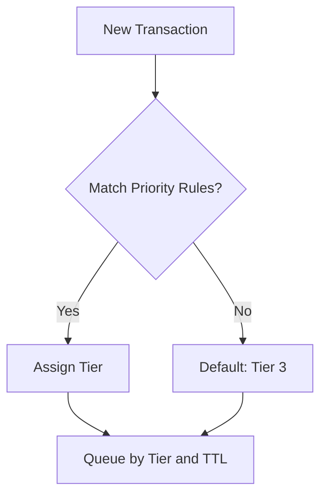

# transaction_priority_rules.md (1)

---

### **📄**

### **transaction_priority_rules.md**

```
# Transaction Priority Rules & Critical Path Logic

## 🎯 Purpose of This Document

This document defines how transactions are prioritized, queued, and processed in AST's NodeChain engine. It outlines the rules for critical-path classification, fee-based priority levels, and handling of time-sensitive operations.

---

## ⚙️ Priority Tiers

| Tier | Name               | Criteria                                                              | TTL           | Fee Modifier |
|------|--------------------|-----------------------------------------------------------------------|---------------|--------------|
| 1    | Critical (Hot)     | Governance, rollback, reverse_tokenization, protocol upgrades         | 15 seconds    | +100%        |
| 2    | High               | Inter-block transfers, node liquidity adjustments                     | 30 seconds    | +50%         |
| 3    | Standard           | User-initiated mint/burn, regular payments                            | 60 seconds    | base fee     |
| 4    | Background (Cold)  | Deferred syncs, periodic audits, internal telemetry                    | 120 seconds   | -50%         |

---

## 🔄 Priority Assignment Flow



---

## **🚦 Queuing Rules**

- Each tier is mapped to a separate internal queue.
- Queues are drained in this order: 1 ➝ 2 ➝ 3 ➝ 4.
- TTL (time-to-live) defines max lifetime in queue.
- Upon TTL expiry → discarded with rejection hash.

---

## **💸 Fee-Based Precedence (Intra-Tier)**

If two transactions belong to the same tier:

- The one with **higher fee modifier** gets priority.
- In case of identical fees → FIFO order applies.

---

## **🔐 Example: Priority Metadata**

```
{
  "tier": 2,
  "queue": "high_priority",
  "expires_at": "2025-06-23T18:46:00Z",
  "fee_modifier": "+50%",
  "position": 3
}
```

---

## **📁 Repository Location**

```
ast/
└── 02_nodechain_engine/
    └── transaction_priority_rules.md
```

```
---

Подтверди, и я перейду к следующему документу: `shard_signature_model.md`.
```