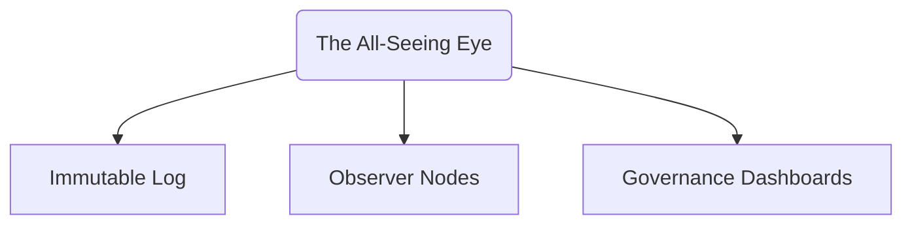

# Integrity Signal Emission

## 1. Purpose

This document defines the protocol by which **The All-Seeing Eye** emits **non-blocking, integrity-related signals** to external observers and governance subsystems. These signals act as architectural flags — indicating deviations, drifts, or irregular patterns that merit attention, **without enforcing any action**.

---

## 2. Signal Types

The Eye may emit the following classes of integrity signals:

| Signal Type           | Description                                             |
|------------------------|---------------------------------------------------------|
| `warning`              | Minor inconsistency or early drift indicator            |
| `alert`                | Confirmed anomaly within allowed scope                  |
| `ping`                 | Passive structural health pulse                         |
| `scope_violation`      | Attempted access or activity outside observation bounds |

---

## 3. Signal Format

Signals are emitted as structured JSON events, cryptographically signed.

```json
{
  "signal_id": "SIG-9382",
  "timestamp": 1731943327,
  "signal_type": "alert",
  "source": "governance_layer",
  "details": {
    "anomaly_id": "GOV-003",
    "description": "Recursive role delegation detected"
  },
  "signature": "0xdeadbeef..."
}
```

---

## 4. Emission Rules

- Signals are **read-only** and **non-binding**
- Emission is **asynchronous** — no coupling to execution timing
- Signals are **logged**, then optionally **broadcast to observer nodes**

They **cannot trigger state changes**, execution halts, or reverts.

---

## 5. Emission Triggers

Signals are emitted when:

- A recognized anomaly pattern is matched
- Observation limits are approached or breached
- Persistent architectural drifts are observed
- Heartbeat pings reach timeout without observer acknowledgment

---

## 6. Signal Recipients

Signals may be received by:

- **Registered Observer Nodes**
- **Governance audit dashboards**
- **External analytics tools** (via public log mirroring)

No privileged access or direct command interfaces exist.

---

## 7. Signal Channel Architecture



All channels are one-directional and read-only.

---

## 8. Rate Limiting & Signal Filtering

To prevent abuse or overload:

- Signals are rate-limited per snapshot/batch window
- Observer nodes can define local filtering thresholds
- High-frequency patterns are bucketed into aggregated summaries

---

## 9. Summary

The All-Seeing Eye communicates only one way: through **signals**.

They do not command or intervene — they **inform**.

These emissions are the final form of its awareness, passed into a system that remains human- or governance-controlled.
