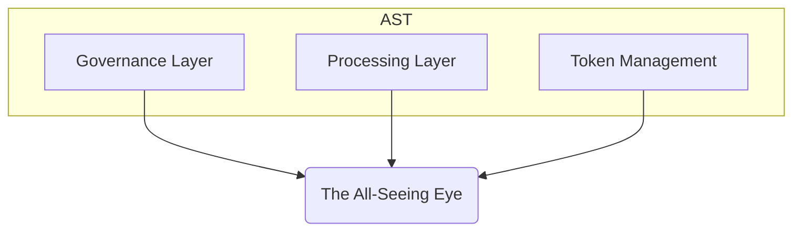

# The All-Seeing Eye — Overview

## 1. Purpose

This document introduces **The All-Seeing Eye**, the passive meta-observation system embedded in the architecture of Aros Studio Tokenomics (AST). It is designed to ensure **architectural integrity**, **non-intrusive oversight**, and **long-range pattern detection** without interfering in the internal execution logic.

---

## 2. Architectural Position

**The All-Seeing Eye** is not part of any active execution domain. It is placed in a **separate observational layer**, external to governance, processing, and token logic.

- It does not modify system state.
- It receives only **read-only metadata** from inner layers.
- It does not participate in any consensus or vote.

---

## 3. Key Principles

| Principle | Description |
| --- | --- |
| Passive Observation | Observes internal AST events and flows without execution rights |
| Architecture-Only Focus | Watches for protocol drift, coordination failures, and structural anomalies |
| Signal Emission Only | Can emit alerts or integrity signals but never commands |
| Immutable Logging | All observations are timestamped and stored in external immutable logs |

---

## 4. Motivations

Why introduce this system?

- **Protect AST from internal misuse**
- Ensure **design-level discipline** over time
- Detect slow drifts and deviations invisible to runtime actors
- Provide a future-proof oversight layer that survives upgrades

---

## 5. Limitations

The Eye cannot:

- Execute transactions
- Block proposals or votes
- Change system state
- Override governance decisions

Its role is **witness, not judge**.

---

## 6. Integration Outline

| Layer Observed | Read-Only Access | Metadata Scope |
| --- | --- | --- |
| Governance Layer | ✅ | Proposals, roles, vote events |
| Processing Layer | ✅ | Queue patterns, replay signals |
| Token Management | ✅ | Mint/burn events, supply drift |

All data is structured and sent through **internal read-only bridges**.

---

## 7. Next Steps

Following this overview, the next documents define:

- Scope and limits ( **observation_scope_and_limits.md** )
- Detection patterns ( **anomaly_detection_patterns.md** )
- Logging protocol ( **meta_event_logging_protocol.md** )
- External interface ( **observer_node_interface.md** )
- Signal logic ( **integrity_signal_emission.md** )
